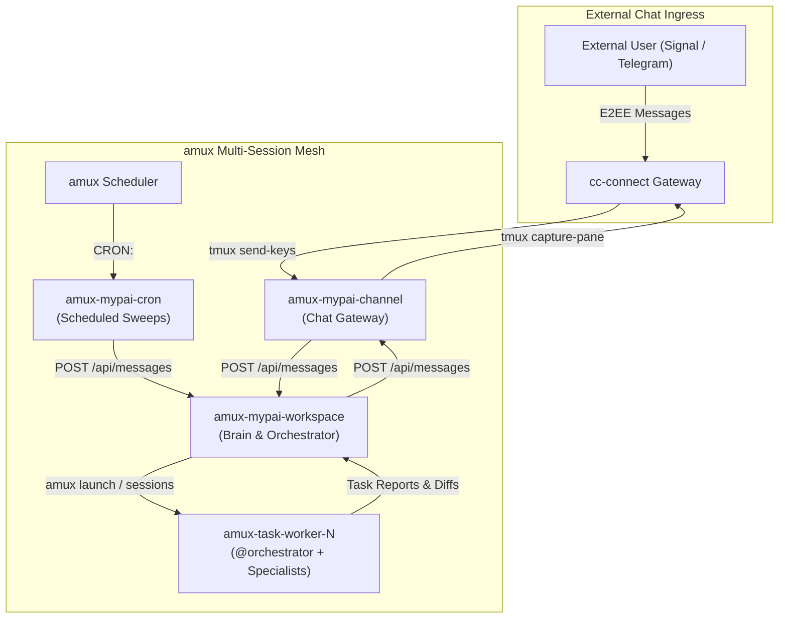

# MyPAI User Guide (`USAGE.md`)

This guide explains how to use **Next-Generation MyPAI** and **Oh-My-Pi (OMP)** from an operator and developer perspective.

---

## 1. System Overview & Core Sessions

MyPAI runs on a distributed multi-session control plane supervised by `amux-server`:



1. **`amux-mypai-workspace` (`mypai-main`):** The primary brain. Maintains your long-term LifeOS memory, manages the `amux` Kanban board, spawns worker sessions for coding tasks, and coordinates replies.
2. **`amux-mypai-channel`:** Dedicated chat ingress connected to `cc-connect`. Ingests incoming messages, parses intent, and forwards tasks to `mypai-workspace`.
3. **`amux-mypai-cron`:** Dedicated automation reactor. Receives scheduled triggers from `amux-server` and performs silent repository and metric health sweeps.
4. **`amux-task-worker-N`:** On-demand coding workers running in project directories with normal OMP profiles.

---

## 2. Managing & Attaching to Sessions

### Visual Cockpit & Web PWA (`aoe`)
The easiest way to monitor all running sessions, diffs, and tool steps is using **Agent of Empires (`aoe`)**:
```bash
# Terminal TUI Matrix
aoe

# Web PWA Dashboard (browser access on localhost:8080 or Tailscale)
aoe serve
```

### Attaching via `tmux`
To directly inspect or interact with any active session pane:
```bash
# Attach to the main orchestrator workspace
tmux attach -t amux-mypai-workspace

# Attach to the communication gateway
tmux attach -t amux-mypai-channel

# Attach to the cron reactor
tmux attach -t amux-mypai-cron

# Attach to an active task worker
tmux attach -t amux-task-worker-1
```
*(Detach at any time with `Ctrl-B d` without interrupting agent execution).*

### Starting New Task Worker Sessions
To spawn a new isolated task worker on a target repository:
```bash
# Via amux CLI
amux launch worker-auth repos/backend-core --provider omp

# Or via Python eval inside mypai-workspace:
from mypai_eval_runtime import amux
amux.spawn_task_worker(
    name="worker-auth",
    directory="repos/backend-core",
    prompt="Refactor auth middleware to support Bearer tokens."
)
```

---

## 3. Agent Roster & Specialist Roles

When interacting with Oh-My-Pi, you can delegate tasks to specialized subagents using `@<role>`:

| Subagent | Role | Best Used For |
| :--- | :--- | :--- |
| **`@orchestrator`** | **Main Project Coordinator** | Epic planning, subagent delegation, diff validation, and strategic escalation. Default entry point. |
| **`@scout`** | **Discovery & Codebase Mapper** | Fast read-only symbol discovery, dependency tree mapping, AST grep searches. |
| **`@debugger`** | **Forensic Root-Cause Investigator** | 4-phase systematic debugging, stack trace analysis, memory profiling, and hypothesis testing. |
| **`@pythonista`** | **Python Engineering Specialist** | Idiomatic Python craftsmanship, type safety (typing/mypy), async/await, ruff formatting, pytest suites. |
| **`@task`** | **General Implementation Worker** | Multi-language feature implementation, refactoring, and multi-file editing. |
| **`@reviewer`** | **Code Quality & Safety Reviewer** | Multi-perspective code review, cross-boundary dispatch verification, P0–P3 structured findings. |
| **`@security-reviewer`** | **Vulnerability Scanner** | Invariant validation, tainted data flow analysis, broken authorization and CVE detection. |
| **`@designer`** | **UI/UX & Design System Specialist** | Token-first CSS/HTML styling, responsive layouts, accessibility (a11y), visual consistency. |
| **`@librarian`** | **External API & Source Researcher** | Clones and inspects upstream source repos to verify API signatures and ground facts in truth. |
| **`@writer`** | **Documentation & Memory Craftsman** | Technical documentation, OpenAPI schemas, changelogs, and Hindsight memory bank distillation. |
| **`@patcher`** | **Ultra-Fast Mechanical Patcher** | Rapid single-file edits, typos, syntax fixes, and minimal latency data collection. |

---

## 4. Engineering Skills Catalog

MyPAI equips agents with high-rigor engineering workflows:

1. **`ulw-plan` (`skills/ulw-plan/SKILL.md`):** Ultralight planning featuring testable **Ideal State Criteria (ISC)**, gap analysis, and phased verification gates.
2. **`systematic-debugging` (`skills/systematic-debugging/SKILL.md`):** 4-phase root-cause methodology (Reproduce -> Isolate -> Hypothesize -> Fix & Verify).
3. **`git-master` (`skills/git-master/SKILL.md`):** Safe worktree isolation (`~/.omp/wt`), uncommitted state protection, atomic conventional semantic commits.
4. **`review-work` (`skills/review-work/SKILL.md`):** Structured multi-pass review rubric and P0–P3 finding schemas.
5. **`test-driven-development` (`skills/test-driven-development/SKILL.md`):** Red-Green-Refactor test cycle.

---

## 5. Custom Slash Command Palette

In any interactive OMP session, you can invoke specialized workflows using slash commands:

* **`/plan`**: Enters native OMP plan mode (uses `write xd://propose` to submit plan proposals for user confirmation).
* **`/ulw-plan`**: Generates a high-rigor Ultralight plan with testable Ideal State Criteria (ISC).
* **`/debug`**: Invokes `@debugger` and the `systematic-debugging` workflow.
* **`/review`**: Spawns `@reviewer` to audit uncommitted diffs or PR branch changes.
* **`/git`** (or `/git-master`): Safe git inspection, worktree branching, and conventional commits.
* **`/scout`**: Spawns `@scout` to explore repository architecture.
* **`/security`**: Runs security vulnerability scan with `@security-reviewer`.
* **`/pythonista`**: Runs deep Python typing, async, and performance optimization pass.
* **`/writer`**: Generates documentation or updates memory banks.
* **`/patch`**: Spawns `@patcher` for quick mechanical edits.
* **`/learn`** (or `/reflect`): Distills recent turn insights into Hindsight mental models.
* **`/escalate`**: Forwards questions or confirmation requests directly to `mypai-workspace`.

---

## 6. In-Kernel Python `eval` Execution (`lang: "py"`)

All coordination across agents is executed in-process using Python `eval` with the unified `mypai_eval_runtime`:

```python
from mypai_eval_runtime import amux

# 1. Send an inter-worker message
amux.send_message(
    target_worker="mypai-workspace",
    body="WORKER_STATUS: Completed auth refactor. Unit tests passing."
)

# 2. Manage Kanban Board Cards
card = amux.create_card(
    title="Upgrade Database Drivers",
    description="Migrate asyncpg to 0.30 in backend-core",
    lane="Doing"
)

# 3. Synchronous in-cell waiting for response
try:
    reply = amux.wait_for_response(
        target_worker="mypai-workspace",
        correlation_id="req-1234",
        timeout=30.0
    )
except TimeoutError:
    print("Workspace did not respond within 30s")
```

---

## 7. Cron & Scheduled Automation Example

Schedules in `amux-server` fire durable triggers directly into `mypai-cron`:

### Registering a Schedule via Python `eval`
```python
from mypai_eval_runtime import amux

amux.post(
    "schedules",
    title="Daily Codebase & Health Sweep",
    session="mypai-cron",
    schedule_expr="0 8 * * *",  # Every day at 08:00
    command="CRON: health_sweep repo=/home/wuxxin/agent-shared/code/mypai",
    enabled=True
)
```

### What Happens When Cron Fires:
1. `amux-server` injects `CRON: health_sweep ...` into `amux-mypai-cron`.
2. `mypai-cron` executes an in-kernel `eval` cell:
   - Probes git status and FIXME markers via native `tool.search()`.
   - Checks server metrics via `amux.get("metrics")`.
3. **If all clean:** Remains **100% silent (0 stdout)**.
4. **If anomalies found:** Files an amux Kanban card (`Todo`) and alerts `mypai-workspace`.

---

## 8. Development, Testing & Quality Assurance (`Makefile`)

The repository includes a modern GNU Makefile to run tests, type checking, and linting locally:

```bash
# View available Makefile targets
make help

# Run the complete test suite (unit + e2e)
make test

# Run unit or end-to-end integration tests separately
make test-unit
make test-e2e

# Run test suite with code coverage
make coverage

# Auto-format and lint code
make format
make lint

# Run static type checking with mypy
make typecheck

# Run full CI validation pipeline
make all
```

For complete architectural details on testing, component contract coverage, and E2E simulation flows, see [references/mypai-test.md](references/mypai-test.md).
