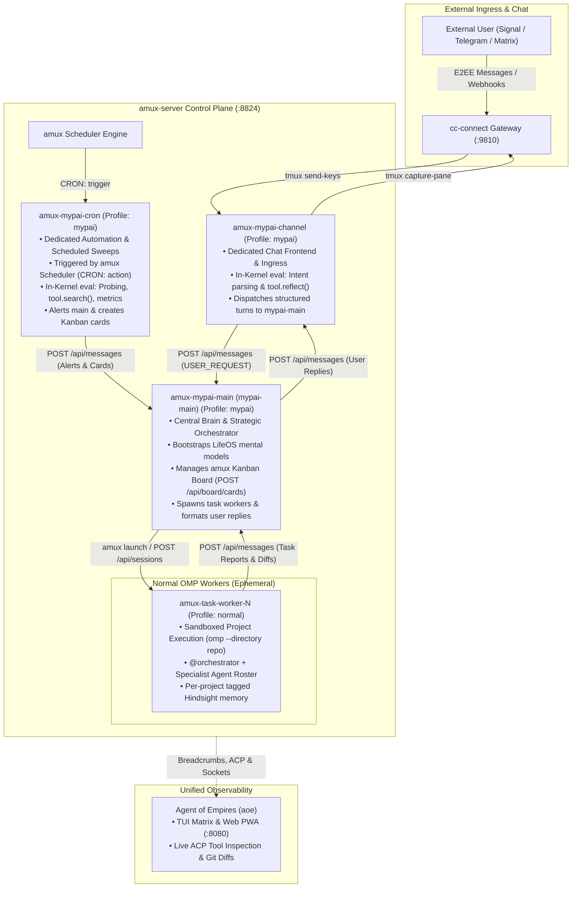
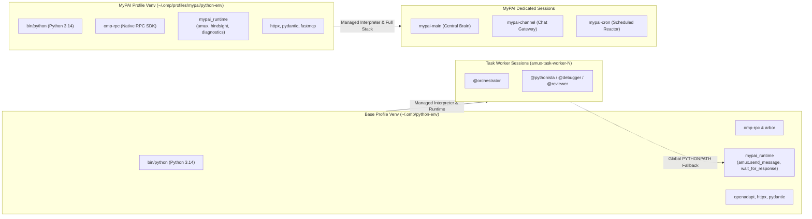

# Next-Generation MyPAI System Specification (`references/mypai-spec.md`)

## Executive Summary

The **Next-Generation MyPAI Architecture** unifies autonomous personal assistance, multi-channel chat routing, scheduled automation, and codebase engineering across a distributed multi-session mesh. Powered by **`amux`**, **`cc-connect`**, **`oh-my-pi` (`omp`)**, and **`Agent of Empires` (`aoe`)**, the system eliminates monolithic daemon bottlenecks and replaces conversational shell scripting with **in-kernel Python `eval` execution (`lang: "py"`)**, **native loopback host tools (`tool.*`)**, and **isolated dual-profile Hindsight memory banks**.

### Self-Contained Repository Architecture (No Plugin Required)
Next-Generation MyPAI eliminates the legacy `omp-mypai` plugin and submodule entirely. Because the monolithic daemon and old MCP wrappers are retired, OMP profiles (`~/.omp/agent/` and `~/.omp/profiles/mypai/agent/`) load natively from filesystem templates, while the in-kernel runtime library (`mypai_runtime`) and management utilities (`bin/membank-ctl`) live directly inside the root `mypai` repository. This eliminates plugin loader latency, removes git submodule friction, and makes `mypai` a clean, standalone repository.

---

## 1. System Topology & Multi-Session Control Plane



### Core Sessions Overview

| Session Name | Profile | Directory | Primary Role | Ingress Source | Egress Target |
| :--- | :--- | :--- | :--- | :--- | :--- |
| **`amux-mypai-channel`** | `mypai` | `mypai-channel` | Dedicated Chat Gateway & Intent Classifier | `cc-connect` tmux driver | `mypai-main` via `POST /api/messages` |
| **`amux-mypai-main`** (`mypai-main`) | `mypai` | `mypai-main` | Central Brain, Strategic Governor & Task Coordinator | `mypai-channel`, `mypai-cron`, Task Workers | `mypai-channel` (replies), `amux` Kanban & Workers |
| **`amux-mypai-cron`** | `mypai` | `mypai-cron` | Timed Probing, Maintenance & Health Sweeps | `amux-server` Scheduler (`CRON: ...`) | `mypai-main` (alerts & cards) |
| **`amux-task-worker-N`** | `normal` (default) | `<target-repo>` | Sandboxed Code Generation, Testing & Refactoring | `mypai-main` task dispatch | `mypai-main` report & diff |

---

## 2. Environment & Virtualenv Architecture

### Profile Virtualenv Resolution in `oh-my-pi`

Oh-My-Pi resolves Python virtual environments per profile. When an agent executes Python cells via the `eval` tool (`lang: "py"`), `omp` resolves the interpreter using the following deterministic search order:

1. **Active / Project Virtualenv:** `$VIRTUAL_ENV` or `./.venv` in the active working directory.
2. **Managed Profile Virtualenv:**
   - For profile `mypai` (`omp --profile mypai`): `~/.omp/profiles/mypai/python-env`
   - For default profile (`omp`): `~/.omp/python-env`
3. **System Interpreter:** `/usr/bin/python` (fallback).

### Virtualenv Separation & Cross-Environment Module Availability



#### How Normal Profile Agents Access `amux.send_message`
Normal profile agents (`omp --directory <repo>`) must be able to communicate with `mypai-main` seamlessly, regardless of whether they execute inside the managed base venv (`~/.omp/python-env`) or an active repo-local venv (`./.venv`).

1. **Dual Venv Installation:** Both `~/.omp/python-env` and `~/.omp/profiles/mypai/python-env` have `mypai_runtime` and `amux` installed during `LAUNCHER_INSTALL_CMDS`.
2. **Global Fallback via `PYTHONPATH`:** `omp.env` exports `PYTHONPATH="$HOME/.omp/python-env/lib/python3.14/site-packages:$PYTHONPATH"`. Even if a task worker runs inside a target repository's `.venv`, Python will cleanly resolve `import amux` or `from mypai_runtime import amux`.
3. **Strict Fail-Fast Engine:** `amux.py` is engineered with `httpx` for connection pooling, keep-alive, and clean typed JSON response validation.

---

## 3. In-Kernel Python `eval` Runtime & Tool Bridge

In the next-generation architecture, all internal coordination, automation, and decision-making is executed directly via in-process Python `eval` cells (`lang: "py"`).

### Persistent Process State & Prelude Injection

1. **Kernel Lifecycle:** `runner.py` maintains persistent process memory in the session venv. Variables, imported modules, and state dictionaries (`_SESSION_BOOTSTRAPPED`, `_MENTAL_MODELS`, `_CORRELATION_MAP`, `_LAST_ERROR`) persist across turns.
2. **Native Host Loopback Proxy (`tool.*`):** `prelude.py` injects `tool = _ToolProxy()`. Calling host tools runs over local IPC in microseconds without spawning subshells:
   - `tool.reflect(query="...", context="...")` -> Synthesizes answers from Hindsight mental models.
   - `tool.recall(query="...")` -> Performs semantic vector & keyword search over memory facts.
   - `tool.retain(items=[{"content": "...", "context": "..."}])` -> Persists durable facts to Hindsight.
   - `tool.read(path)` / `tool.write(path, content)` -> High-speed in-process filesystem I/O.
   - `tool.search(query, glob)` -> Native in-process `ripgrep` search.
3. **Strict Silence-on-Success Discipline:** Successful runs emit **zero stdout** (0 context tokens wasted). Output is generated only for user-facing responses or trapped error directives.

### In-Kernel Helper Library (`mypai_runtime` & `amux.py`)

The runtime provides the `amux` client using `httpx`:

```python
"""amux.py - Inter-agent communication client for all OMP sessions using httpx."""

import os
import time
from typing import Any, Dict, List, Optional
import httpx

class AmuxClient:
    def __init__(self, base_url: Optional[str] = None, verify: bool = False, timeout: float = 30.0):
        self.base_url = (base_url or os.environ.get("AMUX_API_URL", "https://localhost:8824/api")).rstrip("/")
        self.client = httpx.Client(base_url=self.base_url, verify=verify, timeout=timeout)

    def get(self, path: str, params: Optional[Dict[str, Any]] = None) -> Any:
        resp = self.client.get(path.lstrip("/"), params=params)
        resp.raise_for_status()
        return resp.json()

    def post(self, path: str, data: Optional[Dict[str, Any]] = None, **kwargs) -> Any:
        payload = data if data is not None else kwargs
        resp = self.client.post(path.lstrip("/"), json=payload)
        resp.raise_for_status()
        return resp.json()

    def send_message(self, target_worker: str, body: str, correlation_id: Optional[str] = None) -> Dict[str, Any]:
        """Send a structured turn message to another amux agent session."""
        payload: Dict[str, Any] = {
            "target": {"worker_name": target_worker},
            "body": body,
        }
        if correlation_id:
            payload["correlation_id"] = correlation_id
        return self.post("messages", data=payload)

    def wait_for_response(
        self,
        target_worker: str,
        correlation_id: str,
        timeout: float = 30.0,
        poll_interval: float = 0.5
    ) -> Optional[Dict[str, Any]]:
        """
        Polls the amux message bus for a response with matching correlation_id.
        Silently returns the message body on arrival.
        Raises TimeoutError if timeout expires.
        """
        deadline = time.time() + timeout
        while time.time() < deadline:
            inbox = self.get("messages", params={"worker": target_worker, "unread": "true"})
            for msg in inbox.get("messages", []):
                if msg.get("correlation_id") == correlation_id:
                    return msg
            time.sleep(poll_interval)
        raise TimeoutError(f"Timeout waiting for response from '{target_worker}' (correlation: {correlation_id})")

    def create_card(self, title: str, description: str, lane: str = "Todo", tags: Optional[List[str]] = None) -> Dict[str, Any]:
        return self.post("board/cards", data={"title": title, "description": description, "lane": lane, "tags": tags or []})

    def update_card(self, card_id: str, lane: Optional[str] = None, notes: Optional[str] = None) -> Dict[str, Any]:
        payload: Dict[str, Any] = {}
        if lane:
            payload["lane"] = lane
        if notes:
            payload["notes"] = notes
        return self.post(f"board/cards/{card_id}", data=payload)

    def spawn_task_worker(self, name: str, directory: str, prompt: str, provider: str = "omp") -> Dict[str, Any]:
        """Spawns an isolated normal-profile OMP worker session and assigns task."""
        session = self.post("sessions", data={"name": name, "directory": directory, "provider": provider})
        self.send_message(target_worker=name, body=prompt)
        return session

# Global pre-instantiated client available everywhere
amux = AmuxClient()
```

---

## 4. Agent Roles, Input Inspection & Reaction Protocols

### Role 1: `amux-mypai-channel` (Chat Ingress & User Gateway)

- **System Context & Responsibility:** Acts as the single point of contact between the human user (via `cc-connect` over Signal/Telegram) and the MyPAI mesh.
- **Input Inspection:**
  - Receives raw prompt text from `cc-connect` via tmux pane keystrokes.
  - Checks if text contains multi-repo references, user preference updates, or direct commands.
- **In-Kernel Execution Procedure:**
  1. **Bootstrap Check:** On first turn, evaluates `tool.reflect(query="What are the user's communication preferences and tone?")` to populate `_USER_PREFS`.
  2. **Intent Parsing & Dispatch:** Formats a structured `USER_REQUEST` payload and dispatches it to `mypai-main` via `amux.send_message("mypai-main", ...)` with a unique `correlation_id`.
  3. **Response Handling:** Concludes turn or waits for `mypai-main` response. When reply is received, outputs the final formatted text to stdout (which `cc-connect` captures and transmits back to the user).

```python
# Channel Turn Pattern (In-Kernel Python eval)
from mypai_runtime import amux
import uuid

try:
    if "_USER_PREFS" not in globals():
        _USER_PREFS = tool.reflect(query="User communication preferences, brevity, and tone.")
    
    correlation_id = str(uuid.uuid4())
    amux.send_message(
        target_worker="mypai-main",
        body=f"USER_REQUEST: {user_input_text}\nUSER_PREFS: {_USER_PREFS[:200]}",
        correlation_id=correlation_id
    )
except Exception as err:
    globals()["_LAST_ERROR"] = err
    print(f"[ERROR] Channel dispatch failed: {err}")
```

---

### Role 2: `amux-mypai-main` (Central Orchestrator)

- **System Context & Responsibility:** The primary cognitive brain of the system. Governs strategic alignment with the user's TELOS goals, manages the `amux` Kanban board, coordinates task workers, and formulates user-facing responses.
- **Input Inspection:**
  - **`USER_REQUEST: ...`**: User instruction routed from `mypai-channel`.
  - **`CRON_ALERT: ...`**: Anomaly or scheduled notification from `mypai-cron`.
  - **`WORKER_REPORT: ...`**: Completion or failure status from `amux-task-worker-N`.
- **In-Kernel Execution Procedure:**
  1. **Mental Model Alignment:** Calls `tool.reflect(query="Summarize active TELOS goals, active projects, and architectural constraints")` on first turn.
  2. **Task Categorization & Worker Spawning:**
     - For code generation, refactoring, or heavy workspace search: Creates a card (`Doing`) on the amux board and spawns an isolated normal-profile OMP worker (`omp --directory <target-repo>`).
     - For strategic decisions, life organization, or direct inquiries: Synthesizes response immediately using Hindsight reflection.
  3. **Worker Supervision & Synthesis:** Aggregates worker outputs, runs verification checks if needed, updates card to `Done`, and retains strategic decisions via `tool.retain()`.
  4. **User Communication:** Dispatches final user-facing text back to `mypai-channel` via `amux.send_message("mypai-channel", ...)`.

```python
# Main Turn Pattern (In-Kernel Python eval)
from mypai_runtime import amux

try:
    if "_STRATEGIC_MODELS" not in globals():
        _STRATEGIC_MODELS = tool.reflect(
            query="Summarize user profile, principal telos, active project commitments, and non-negotiables."
        )
    
    # Example: Processing a coding task from channel
    card = amux.create_card(
        title="Refactor Auth Middleware",
        description="Add Bearer token support in repos/backend-core",
        lane="Doing"
    )
    
    # Spawn normal OMP task worker
    amux.spawn_task_worker(
        name=f"worker-auth-{card['id']}",
        directory="repos/backend-core",
        prompt="Refactor auth middleware to support bearer tokens. Run pytest when done."
    )
except Exception as err:
    globals()["_LAST_ERROR"] = err
    print(f"[ERROR] Main coordination failed: {err}")
```

---

### Role 3: `amux-mypai-cron` (Durable Automation & Probing Reactor)

- **System Context & Responsibility:** Executes periodic sweeps, repository audits, memory consolidations, and health checks without human intervention.
- **Input Inspection:** Receives `CRON: <action> [params...]` prompts directly from the `amux` scheduler engine.
- **In-Kernel Execution Procedure:**
  1. **Action Routing:**
     - `CRON: health_sweep`: Scans git status, builds, and metrics via `tool.search()`, `tool.read()`, and `amux.get_metrics()`.
     - `CRON: memory_consolidation`: Triggers Hindsight `/consolidate` and refreshes active mental models.
     - `CRON: daily_standup`: Collects completed cards and drafts daily summary.
  2. **Conditional Escalation:**
     - If all checks pass: Remains **100% silent (0 stdout)**.
     - If anomalies or failures are detected: Files an amux Kanban card (`Todo`) and alerts `mypai-main` via `amux.send_message("mypai-main", ...)`.

```python
# Cron Turn Pattern (In-Kernel Python eval)
from mypai_runtime import amux

try:
    # 1. Probing via loopback bridge
    todos = tool.search(query="FIXME", glob="*.py")
    metrics = amux.get_metrics()
    
    if metrics.get("failed_runs", 0) > 0 or len(todos) > 20:
        amux.create_card(
            title="CRON Alert: High FIXME density or failed jobs",
            description=f"Failed runs: {metrics.get('failed_runs')}, FIXMEs: {len(todos)}",
            lane="Todo"
        )
        amux.send_message(
            target_worker="mypai-main",
            body="CRON Alert: Health sweep detected issues. Card filed."
        )
    # Success: silent (0 stdout)
except Exception as err:
    globals()["_LAST_ERROR"] = err
    print(f"[ERROR] Cron execution failed: {err}")
```

---

## 5. Cross-Agent Interaction & Asynchronous Waiting Mechanisms

### Inter-Agent Communication Analysis

1. **Can an agent make a direct tool call inside another agent's memory?**
   - **No**: Each agent runs in its own separate OS process, virtualenv, and tmux session. Direct memory invocation across boundaries violates isolation invariants.
   - **Solution**: Cross-agent interaction uses the **`amux` Inter-Worker Message Bus (`POST /api/messages`)**. A message sent to a target worker is placed into that worker's turn queue / steering boundary, triggering the target agent to execute native tools in its own context.

2. **Can an agent call a function that waits for a specific time and returns silently on message arrival or raises an error on timeout?**
   - **Yes**: Implemented via `amux.wait_for_response(target_worker, correlation_id, timeout=30)` in `mypai_runtime`.
   - While running in an `eval` cell, the function polls the `amux` inbox:
     - **Arrival within timeout:** Returns the payload data silently (zero stdout).
     - **Timeout:** Raises `TimeoutError` or emits a diagnostic error prompt.

3. **Synchronous In-Cell Wait vs. Asynchronous Turn Handoff:**
   - **Mode A (Synchronous In-Cell Wait):** Used for short round-trips (< 30s) where the calling agent needs the result before finalizing its turn.
   - **Mode B (Asynchronous Turn Handoff):** Used for long-running worker tasks (e.g. 5-minute test suites). The calling agent sends the task with a `correlation_id` and finishes its turn silently. When the worker completes, it sends a response to `mypai-main`, which wakes up `mypai-main` as a new event-driven turn.

---

## 6. Hindsight Memory & Mental Model Configuration

### Dual-Profile Memory Strategy

| Dimension | `mypai` Profile (`~/.omp/profiles/mypai/`) | Base `oh-my-pi` Profile (`~/.omp/agent/`) |
| :--- | :--- | :--- |
| **Bank ID** | `mypai` | `oh-my-pi` |
| **Scoping** | `global` | `per-project-tagged` |
| **Retain Mode** | `turn` | `full-session` |
| **Auto Recall** | `false` (explicit/in-kernel directed recall) | `true` (automatic prompt injection) |
| **Auto Retain** | `false` (curated knowledge ingestion) | `true` (automatic turn capture) |
| **Autolearn** | `true` | `true` |

### Integrated MyPAI Bank Configuration (`omp/profiles/mypai/memorybanks/mypai.yaml`)

Incorporating all missions and mental models from `references/memorybanks-research/assistant-test.yaml`:

```yaml
version: '1'
bank:
  retain_mission: >
    Consolidate the user's preferences, recurring patterns in behavior, routines, scheduled events,
    commitments, decisions, mood tracking metrics, relational and social updates, and psychological insights.
    Consolidate details relating to their sleep-wake schedule, supplement stacks, workout sessions, and
    interpersonal encounters. Ignore small talk and transient details. Consolidate what they ask for repeatedly
    and what they care about. What annoys them? What makes them laugh? Consolidate the user's running machine
    configuration, available tools, paths/services shared with the agent, the agent harness, and active features.
  enable_observations: true
  observations_mission: >
    Extract the user's preferences, recurring patterns in habits, routines, constraints, values, decisions,
    physical wellness (fasting, sleep, health, supplements), mood and emotional state, personal context,
    relational network, and ADHD-specific coping strategies. Extract the user's running machine configuration,
    available tools, shared paths, and agent harness features. Capture behavioral cues for future adaptation.
  reflect_mission: >
    Synthesize an empathetic, actionable, and highly context-aware response based on the user's core preferences,
    routines, physical/psychological wellness, ADHD coping strategies, active commitments, and running host environment.
    Highlight actionable recommendations, deadlines, and emotional/relational nuances while respecting boundaries.

mental_models:
  - id: user-profile
    name: User Profile & Core Preferences
    source_query: >
      What are the core facts about the user? What is his professional background, preferred programming
      languages/tools, contact details, timezone, and surroundings, and how do they like to be helped?
    max_tokens: 2048
    trigger:
      mode: full
      refresh_after_consolidation: true

  - id: worldview-philosophy-maxims
    name: Worldview, Philosophy & Maxims
    source_query: >
      What are User's core beliefs, philosophical views, maxims/quotes, visions, political views, business ideas,
      comedy ideas, deep questions, and general principles?
    max_tokens: 2048
    trigger:
      mode: full
      refresh_after_consolidation: true

  - id: host-agent-config
    name: User Host & Agent Environment Profile
    source_query: >
      What are the core facts about the user's host machine? (Hardware, OS, major packages for local inference
      and agent setup) What packages are used for inference, memory, and channels? What tools and shared paths are configured?
    max_tokens: 2048
    trigger:
      mode: full
      refresh_after_consolidation: true

  - id: inner-work
    name: Inner Work, Dreams & Mood History
    source_query: >
      What are the user's dream logs, shadow work, active imagination sessions, mood tracking logs, and reviews?
    max_tokens: 2048
    trigger:
      mode: full
      refresh_after_consolidation: true

  - id: routines-health
    name: Routines & Wellness Stack
    source_query: >
      What is the user's daily sleep-wake schedule, routine, supplement intake timing/details, fasts, workout
      activities, and wellness routines?
    max_tokens: 2048
    trigger:
      mode: full
      refresh_after_consolidation: true

  - id: project-tasks-commitments
    name: Active Tasks & Accountability
    source_query: >
      What are the user's active/short/mid-term tasks, project details, Socratic check-ins, commitments, and deadlines?
    max_tokens: 1024
    trigger:
      mode: full
      refresh_after_consolidation: true

  - id: inner-work-protection
    name: Grief Processing & Protection
    source_query: >
      What are the user's emotional grief processing, trigger boundaries, anniversaries, coping/recovery strategies,
      and dialogue between inner parts (protectors, firefighters, exiles)?
    max_tokens: 2048
    trigger:
      mode: full
      refresh_after_consolidation: true

  - id: relational-network
    name: Relational Network & Encounters
    source_query: >
      Who are the people the user mentions? What is the background, context, and timeline of his interactions
      and encounters with them?
    max_tokens: 1024
    trigger:
      mode: full
      refresh_after_consolidation: true
```

### Slim Base OMP Bank Configuration (`omp/agent/memorybanks/oh-my-pi.yaml`)

```yaml
version: '1'
bank:
  disposition_skepticism: 3
  disposition_literalism: 3
  disposition_empathy: 4
  retain_extraction_mode: concise
  enable_observations: true
  enable_auto_consolidation: true
  recall_max_tokens: 1536

mental_models:
  - id: user-preferences
    name: User Preferences
    source_query: >
      What does the user prefer in coding style, tooling, communication, and review?
      Capture only durable preferences expressed across sessions.
    max_tokens: 600
    trigger:
      mode: delta
      refresh_after_consolidation: true

  - id: project-conventions
    name: Project Conventions
    source_query: >
      What are this project's conventions for code style, build, testing, release, and pull-request review?
    max_tokens: 800
    trigger:
      mode: delta
      refresh_after_consolidation: true

  - id: project-decisions
    name: Project Decisions
    source_query: >
      What durable architectural or product decisions have been made for this project, and what rationale was recorded?
    max_tokens: 800
    trigger:
      mode: delta
      refresh_after_consolidation: true

  - id: active-initiatives-and-commitments
    name: Active Initiatives & Commitments
    source_query: >
      What are the active project initiatives, open commitments, pending deliverables, and work sweep state?
    max_tokens: 1000
    trigger:
      mode: delta
      refresh_after_consolidation: true
```

---

## 7. Sandbox Launcher & Daemon Provisioning (`omp.env`)

In `omp.env`, the service setup is re-architected from the single `mypai_daemon` to the `amux` control plane and `cc-connect` bridge:

```bash
# Core Environment Exports
OMP_PYTHON_VENV="$HOME/.omp/python-env"
MYPAI_PYTHON_VENV="$HOME/.omp/profiles/mypai/python-env"
MYPAI_MAIN_DIR="$HOME/agent-shared/mypai-main"
MYPAI_CHANNEL_DIR="$HOME/agent-shared/mypai-channel"
MYPAI_CRON_DIR="$HOME/agent-shared/mypai-cron"

# Primary Service Execution (amux server)
LAUNCHER_SERVICE_ENABLED="true"
LAUNCHER_SERVICE_CMD="amux-server"
LAUNCHER_SERVICE_ARGS="--port 8824 --data-dir $HOME/.amux"

# Persistent Sidecars: cc-connect bridge
LAUNCHER_SIDECARS="cc_connect"
LAUNCHER_SIDECAR_CC_CONNECT_CMD="cc-connect"
LAUNCHER_SIDECAR_CC_CONNECT_ARGS="--config $HOME/.cc-connect/config.toml"

# Idempotent Install Routine
# 1. Copies config.yml, mcp.json, models.yml, and agent instructions to ~/.omp/agent and ~/.omp/profiles/mypai/agent
# 2. Provisions ~/.omp/python-env (base) and ~/.omp/profiles/mypai/python-env (mypai profile)
# 3. Installs omp-rpc and mypai_runtime into both environments
# 4. Imports initial amux schedules for mypai-cron
# 5. Updates Hindsight memory banks using membank-ctl
```

---

## 8. Reconciliation of Roles, Specialists & Agent Archetypes

The Next-Generation MyPAI ecosystem reconciles the built-in `oh-my-pi` subagents, the `oh-myopencode-slim` profiles, the `obra/superpowers` workflows, and the `athola/claude-night-market` domain specialist archetypes into a unified, high-performance agent roster.

### Reconciled Agent Roster Matrix

| Agent Name (`@name`) | Origin / Lineage | Role & Capabilities | Tool Access | Model Role | Thinking Effort | Hindsight Integration |
| :--- | :--- | :--- | :--- | :--- | :--- | :--- |
| **`@orchestrator`** | `omp` / `mypai` | Main project coordinator; breaks down epics, delegates to specialists, manages Kanban claims, verifies diffs, escalates strategic decisions to `mypai-main`. | `read`, `bash`, `edit`, `write`, `grep`, `glob`, `lsp`, `task`, `todo` | `@orchestrator` | `auto` / `medium` | Queries `user-preferences`, `project-conventions`, `project-decisions`; retains outcomes on task completion. |
| **`@scout`** | `oh-myopencode-slim` + `cartograph` | Rapid codebase exploration, dependency graph mapping, symbol discovery, AST search. Fast read-only with structured `yield` output. | `read`, `grep`, `glob`, `lsp`, `ast_grep`, `web_search`, `yield` | `@smol` | `minimal` / `medium` | Injects codebase conventions into findings; stores mapped architecture in `project-conventions`. |
| **`@debugger`** | `claude-night-market` (`scry`) + `superpowers` | Deep root-cause investigation, memory/leak profiler, execution log forensics, stack trace unwinding, hypothesis-driven debugging. | `read`, `grep`, `glob`, `bash`, `lsp`, `ast_grep`, `yield` | `@slow` | `high` / `xhigh` | Captures root cause mechanisms and bug patterns into Hindsight anti-criteria models. |
| **`@pythonista`** | `claude-night-market` (`parseltongue`) + `task` | Idiomatic Python engineering specialist (typing, async, generator pipelines, ruff/mypy/pytest compliance, zero-cost abstractions) & multi-language editor. | `read`, `edit`, `write`, `grep`, `glob`, `bash`, `lsp`, `yield` | `@task` | `auto` | Enforces project coding style extracted from `user-preferences` and `project-conventions`. |
| **`@reviewer`** | `oh-myopencode-slim` + `pensive` | Multi-perspective code review, Socratic critique, patch verification, cross-boundary dispatch validation, safety & regression auditor. | `read`, `grep`, `glob`, `bash`, `lsp`, `ast_grep`, `yield` | `@slow` | `high` | Audits diffs against `project-decisions` and security anti-criteria; yields P0-P3 structured findings. |
| **`@security-reviewer`** | `omp` built-in (`codex-security`) | Vulnerability scanner, CVE analysis, tainted data flow tracer, broken authorization & injection detector. | `read`, `grep`, `glob`, `lsp`, `ast_grep`, `yield` | `@slow` | `high` | Validates compliance with `lifeos-anti-criteria` and security invariants. |
| **`@designer`** | `oh-myopencode-slim` | UI/UX implementation, design system tokenization, CSS styling, responsive layout, accessibility (a11y), visual consistency. | `read`, `edit`, `write`, `grep`, `glob`, `bash` | `@designer` | `medium` | Adheres to design token models in Hindsight; enforces anti-slop guidelines. |
| **`@librarian`** | `oh-myopencode-slim` | External dependency & API researcher; inspects local `node_modules`/`vendor` or clones upstream repos to verify signatures and behavior. | `read`, `grep`, `glob`, `bash`, `lsp`, `web_search`, `ast_grep`, `yield` | `@smol` | `minimal` | Persists verified API contracts and quirks into `mypai-knowledge` memory banks. |
| **`@writer`** | `claude-night-market` (`scribe`/`tome`) | Technical writer, documentation craftsman, OpenAPI/schema author, changelog & memorybank distiller. | `read`, `edit`, `write`, `grep`, `glob`, `yield` | `@smol` | `minimal` | Updates Hindsight memory banks, writes specifications, distills session learnings. |
| **`@patcher`** | `oh-myopencode-slim` (`sonic`) | Ultra-fast mechanical patcher for tiny single-file tweaks, typos, syntax errors, or simple data collection. | `read`, `edit`, `write`, `grep`, `glob`, `bash` | `@smol` | `minimal` | Rapid execution with zero memory overhead. |
| **`@task`** | `omp` built-in | General-purpose worker for delegated multi-step implementation tasks. | `read`, `edit`, `write`, `grep`, `glob`, `bash`, `lsp` | `@task` | `auto` | Follows standard task execution directives. |

---

## 9. OMP Built-in `xd://` Virtual Tool Devices & Native Tooling

`oh-my-pi` unifies tool presentation through virtual tool devices mounted under the `xd://` transport:

### `xd://` Device Transport Interface
- **Discovery:** `read xd://` lists all ambient and mounted tool devices (MCP servers, custom extensions, RPC host tools, image generator, TTS).
- **Documentation & Schemas:** `read xd://<tool>` fetches the exact parameter schema and tool documentation.
- **Execution:** `write xd://<tool>` passes JSON payloads to invoke the mounted device.
- **Plan & Preview Resolution Devices:**
  - `write xd://propose`: Submits a plan slug and summary for interactive user approval.
  - `write xd://resolve`: Applies staged file edits and diff previews.
  - `write xd://reject`: Discards staged previews.

---

## 10. Reconciliation of Planning Modes & Engineering Skills

The system provides dual planning modes alongside high-rigor engineering workflows:

### A. Dual Planning Modes
1. **Normal OMP Plan (`commands/plan.md` / `/plan`):**
   - Leverages OMP's native plan mode and resolution devices (`write xd://propose`).
   - Enters plan mode, audits code with read-only tools, drafts the approach, submits the plan proposal for user approval, and executes upon confirmation.
2. **Ultralight / Superpowers Plan (`commands/ulw-plan.md` / `skills/ulw-plan` / `/ulw-plan`):**
   - High-rigor engineering planning featuring testable **Ideal State Criteria (ISC)**, gap analysis, file-by-file delta listings (`[NEW]`, `[MODIFY]`, `[DELETE]`), and automated verification gates.

### B. Engineering Skills (`omp/agent/skills/`)
1. **`ulw-plan` (`skills/ulw-plan/SKILL.md`):** Ultralight planning methodology with ISC and verification gates.
2. **`systematic-debugging` (`skills/systematic-debugging/SKILL.md`):** 4-phase root-cause investigation (Reproduce -> Isolate -> Form Hypothesis -> Verify & Fix).
3. **`git-master` (`skills/git-master/SKILL.md`):** Safe worktree isolation (`~/.omp/wt`), uncommitted state protection, atomic conventional commits.
4. **`review-work` (`skills/review-work/SKILL.md`):** Structured multi-pass review rubric and P0-P3 finding schemas.
5. **`test-driven-development` (`skills/test-driven-development/SKILL.md`):** Red-Green-Refactor test cycle.

---

## 11. Slash Command Palette (`commands/`)

Custom slash commands live in `omp/agent/commands/*.md`:

| Slash Command | File Path | Action & Specialist Delegation |
| :--- | :--- | :--- |
| **`/plan`** | `commands/plan.md` | Native OMP planning workflow using `write xd://propose`. |
| **`/ulw-plan`** | `commands/ulw-plan.md` | Executes the high-rigor `ulw-plan` skill with testable ISC. |
| **`/debug`** | `commands/debug.md` | Invokes `@debugger` and `systematic-debugging` skill. |
| **`/review`** | `commands/review.md` | Spawns `@reviewer` to audit uncommitted diffs or PR branches. |
| **`/git`** (or `/git-master`) | `commands/git-master.md` | Runs safe git status inspection, worktree management, and semantic commit authoring. |
| **`/scout`** | `commands/scout.md` | Spawns `@scout` for rapid codebase survey and symbol mapping. |
| **`/security`** | `commands/security.md` | Spawns `@security-reviewer` for vulnerability scanning. |
| **`/pythonista`** | `commands/pythonista.md` | Spawns `@pythonista` for deep Python typing, async, and performance optimization. |
| **`/writer`** | `commands/writer.md` | Spawns `@writer` to write technical documentation, API specifications, or update memory banks. |
| **`/patch`** | `commands/patch.md` | Spawns `@patcher` for rapid single-file mechanical edits. |
| **`/learn`** (or `/reflect`) | `commands/learn.md` | Executes `tool.retain()` and `tool.reflect()` to distill session insights into Hindsight mental models. |
| **`/escalate`** | `commands/escalate.md` | Calls `amux.send_message("mypai-main", ...)` to request user confirmation or strategic direction. |

## 12. Hindsight Memory Integration

Every subagent, skill, and command is natively wired into the Hindsight memory architecture:

1. **Pre-Execution Context Grounding:**
   - Before executing code, agents query active mental models (`tool.reflect()` or automatic prompt injection):
     - `@orchestrator` / `@reviewer` check `project-conventions` and `project-decisions`.
     - `@designer` checks design token models and UI preferences.
     - `@pythonista` checks language conventions and formatting rules.
2. **In-Flight Anti-Criteria Enforcement:**
   - High-severity bugs discovered by `@debugger` and security violations found by `@security-reviewer` are matched against `lifeos-anti-criteria`.
3. **Post-Task Distillation:**
   - Completed milestones and architectural trade-offs are curated and persisted via `tool.retain()`, ensuring long-term mental models evolve continuously across sessions.

---

## 13. OMP Advanced Capabilities Directives & `agent_inclusion`

To guarantee that all agents and skills leverage the unique high-performance capabilities of `oh-my-pi`, every agent system prompt embeds the standard **OMP Advanced Capabilities Directive (`agent_inclusion`)**:

```markdown
<omp_advanced_capabilities>
## Programmatic Tool Calling & In-Kernel Execution (`eval`)
- For tasks involving multi-file searches, data processing (>50KB), batch edits, or API interactions, you MUST use the persistent `eval` tool (`lang: "py"` or `lang: "js"`) rather than issuing sequential individual tool calls.
- Loopback Host Tools: Call `tool.read()`, `tool.write()`, `tool.search()`, `tool.reflect()`, `tool.recall()`, and `tool.retain()` directly from within code over the high-speed loopback IPC bridge.
- Persistent Session State: Variables, client connections, and state in `globals()` persist across turns in the kernel.

## DAP & Debug Attachment
- When investigating runtime crashes, test failures, or state anomalies, use DAP (Debug Adapter Protocol) and debug attachment features to inspect live stack frames, evaluate variables in process memory, and trace execution before proposing code modifications.

## Virtual Tool Devices (`xd://`)
- Ambient discoverable tools and MCP servers are mounted under `xd://`. Use `read xd://` to list devices, `read xd://<tool>` to inspect schemas, and `write xd://<tool>` to execute.
- Plan Mode: Use `write xd://propose` to submit proposed plan slugs for user approval.
- Diff Previews: Use `write xd://resolve` to apply staged previews or `write xd://reject` to discard.

## Inter-Worker Communication (`mypai_runtime`)
- To coordinate with other agents or escalate strategic decisions, import `amux` from `mypai_runtime` and call `amux.send_message(target_worker="mypai-main", body="...")`.
- Use `amux.wait_for_response(target_worker, correlation_id, timeout=30)` for in-cell synchronous polling.
</omp_advanced_capabilities>
```

---

## 14. Architectural Invariants & Anti-Fallback Principles

Next-Generation MyPAI explicitly rejects defensive silent fallbacks and degraded modes. Silent fallbacks mask configuration errors, produce non-deterministic behavior, degrade performance by orders of magnitude, and violate architectural integrity. The system enforces **strict fail-fast invariant checks** with deterministic provisioning.

### Audited Architecture Fallbacks & Invariant Enforcement

| Subsystem | Potential / Deprecated Fallback | Anti-Fallback Policy & Invariant Enforcement | Rationale & Failure Mode Avoided |
| :--- | :--- | :--- | :--- |
| **1. HTTP Networking** | Fall back to standard library `urllib.request` if `httpx` is missing. | **STRICT `httpx` INVARIANT.** `httpx` is declared in `pyproject.toml` and pre-installed in both virtual environments (`~/.omp/python-env` and `~/.omp/profiles/mypai/python-env`). `AmuxClient` strictly imports `httpx`. | Avoids splitting client logic between two implementations; preserves connection pooling, HTTP/2, keep-alive, and clean typed response validation. |
| **2. Python Environment** | Fall back to system `/usr/bin/python` if profile venv is missing. | **STRICT MANAGED VENV INVARIANT.** `LAUNCHER_INSTALL_CMDS` provisions both venvs idempotently with all required packages. Sessions verify the active virtualenv on startup; if unprovisioned, they fail fast with explicit repair instructions (`sandbox-ctl install omp`). | System Python lacks `httpx`, `pydantic`, `omp-rpc`, and `mypai_runtime`; falling back causes mysterious runtime import errors inside agent turns. |
| **3. Inter-Worker Comms** | Fall back to typing keystrokes via `tmux send-keys` between agent sessions. | **STRICT `amux` HTTP BUS INVARIANT.** All cross-session turns and worker coordination must route through `amux-server` (`POST /api/messages`) with JSON payloads and correlation IDs. | Unstructured keystroke injection risks terminal race conditions, missing delivery confirmations, and corrupting active agent prompts. |
| **4. Host Tool Calling** | Fall back to invoking subshells (`bash`: `cat`, `grep`, `sed`) instead of in-process tools. | **STRICT IN-KERNEL LOOPBACK INVARIANT.** Agents must use `tool.read()`, `tool.write()`, and `tool.search()` via the persistent Python kernel (`lang: "py"`). | Shell subshells introduce 10x process spawn overhead, shell escaping hazards, and massive context token bloat. |
| **5. Memory Persistence** | Silently drop memories or write to loose scratch files if Hindsight is unreachable. | **STRICT HINDSIGHT SERVICE INVARIANT.** Hindsight (`:8888`) is a supervised core service. `HindsightClient` raises explicit HTTP exceptions if unreachable, signaling an infrastructure alert. | Silent fallback causes cognitive fragmentation and permanent loss of user mental models. |
| **6. Tool Discovery** | Flood the model's top-level system prompt with raw JSON schemas if `xd://` is unconfigured. | **STRICT `xd://` VIRTUAL DEVICE INVARIANT.** `tools.xdev: true` is strictly enforced in `config.yml`. All MCP and custom tools mount under `xd://`. | Prevents wasting 40,000+ prompt tokens on tool definitions and prevents provider prompt cache invalidation. |
| **7. Error Handling** | Catch-all `except Exception: pass` in polling and event loops. | **STRICT EXCEPTION VISIBILITY INVARIANT.** All runtime errors capture full stack traces into `_LAST_ERROR`, log diagnostic telemetry, and raise typed domain errors (e.g. `TimeoutError`, `WorkerExecutionError`). | Suppressing exceptions hides underlying infrastructure and timeout defects from operator inspection. |
| **3. Inter-Worker Comms** | Fall back to typing keystrokes via `tmux send-keys` between agent sessions. | **STRICT `amux` HTTP BUS INVARIANT.** All cross-session turns and worker coordination must route through `amux-server` (`POST /api/messages`) with JSON payloads and correlation IDs. | Unstructured keystroke injection risks terminal race conditions, missing delivery confirmations, and corrupting active agent prompts. |
| **4. Host Tool Calling** | Fall back to invoking subshells (`bash`: `cat`, `grep`, `sed`) instead of in-process tools. | **STRICT IN-KERNEL LOOPBACK INVARIANT.** Agents must use `tool.read()`, `tool.write()`, and `tool.search()` via the persistent Python kernel (`lang: "py"`). | Shell subshells introduce 10x process spawn overhead, shell escaping hazards, and massive context token bloat. |
| **5. Memory Persistence** | Silently drop memories or write to loose scratch files if Hindsight is unreachable. | **STRICT HINDSIGHT SERVICE INVARIANT.** Hindsight (`:8888`) is a supervised core service. `HindsightClient` raises explicit HTTP exceptions if unreachable, signaling an infrastructure alert. | Silent fallback causes cognitive fragmentation and permanent loss of user mental models. |
| **6. Tool Discovery** | Flood the model's top-level system prompt with raw JSON schemas if `xd://` is unconfigured. | **STRICT `xd://` VIRTUAL DEVICE INVARIANT.** `tools.xdev: true` is strictly enforced in `config.yml`. All MCP and custom tools mount under `xd://`. | Prevents wasting 40,000+ prompt tokens on tool definitions and prevents provider prompt cache invalidation. |
| **7. Error Handling** | Catch-all `except Exception: pass` in polling and event loops. | **STRICT EXCEPTION VISIBILITY INVARIANT.** All runtime errors capture full stack traces into `_LAST_ERROR`, log diagnostic telemetry, and raise typed domain errors (e.g. `TimeoutError`, `WorkerExecutionError`). | Suppressing exceptions hides underlying infrastructure and timeout defects from operator inspection. |

---

## 15. Testing Architecture & Quality Automation

The testing architecture ensures zero regressions, 97%+ code coverage, and deterministic verification across all multi-session components. For exhaustive details, component test matrices, and E2E simulation sequence diagrams, see the dedicated testing specification in [references/mypai-test.md](references/mypai-test.md).

### Makefile Target Reference
- `make help`: Interactive target overview and active configuration discovery.
- `make buildenv`: UV-managed local virtual environment provisioning with test dependencies (`.[test]`).
- `make test`: Executes all unit and E2E multi-session tests via `pytest`.
- `make coverage`: Generates line-level test coverage reports and XML artifacts.
- `make lint` & `make format`: Automated code styling, import sorting, and lint verification via `ruff`.
- `make typecheck`: Strict static type validation via `mypy` for Python 3.14 compatibility.
- `make all`: End-to-end CI pipeline validation.


