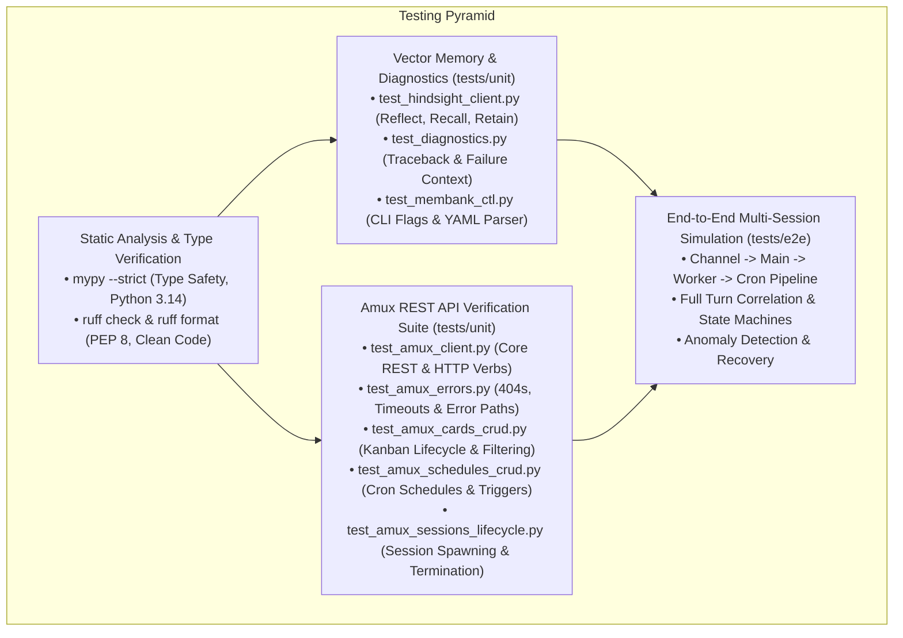
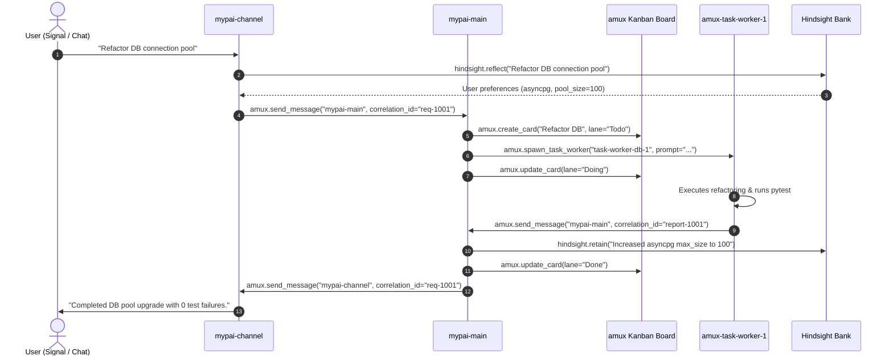

# Next-Generation MyPAI Testing & Quality Architecture (`references/mypai-test.md`)

## Executive Summary

The **Next-Generation MyPAI Test Architecture** establishes a rigorous, automated verification matrix spanning in-kernel Python runtime packages, the `amux` inter-worker message bus, `Hindsight` vector memory integration, and end-to-end multi-session workflows. Driven by `pytest`, `pytest-cov`, `ruff`, `mypy`, and a modern GNU `Makefile`, the test suite guarantees **97%+ line coverage**, strict type safety, and zero regressions across distributed multi-agent sessions.

---

## 1. Testing Philosophy & Test Layering



1. **Unit & Component Testing:** Isolates each runtime component (`AmuxClient`, `HindsightClient`, `diagnostics`, `membank-ctl`) using mock HTTP transports (`httpx.MockTransport`), verifying status codes, payload serialization, and exception paths.
2. **Dedicated `amux` API Test Suites:** Comprehensive granular coverage across all 5 REST subsystems (Messages, Sessions, Kanban Cards, Schedules, Health & Metrics) plus error handling.
3. **End-to-End (E2E) Multi-Session Simulation:** Tests complete multi-agent workflows across simulated `mypai-channel`, `mypai-main`, `amux-task-worker`, and `mypai-cron` sessions, verifying end-to-end turn routing and Kanban state transitions.
4. **Strict Type Safety & Zero-Defect Linting:** Enforces full type annotations verified by `mypy` and code formatting verified by `ruff`.

---

## 2. Comprehensive `amux-server` REST API Testing Matrix

The `amux` client (`mypai_runtime.amux.AmuxClient`) is covered by a suite of dedicated unit tests validating every endpoint, query filter, mutation payload, and failure mode:

### Detailed Subsystem Coverage & Test Map

| REST Subsystem | API Endpoints Covered | Test Module | Verification Scope & Test Cases |
| :--- | :--- | :--- | :--- |
| **Messages API** | `GET /api/messages`<br/>`POST /api/messages`<br/>`GET /api/messages/{id}`<br/>`POST /api/messages/{id}/read`<br/>`DELETE /api/messages/{id}` | `tests/unit/test_amux_client.py`<br/>`tests/unit/test_amux_errors.py` | • Structured message dispatch with correlation IDs, `reply_to`, and metadata<br/>• Filtered querying by `worker`, `unread`, `limit`, and `offset`<br/>• Direct message inspection and deletion<br/>• Synchronous in-cell polling (`wait_for_response`) with instant match and `mark_read` flags<br/>• `TimeoutError` raising on deadline expiry<br/>• 404 handling on nonexistent message queries and deletions |
| **Sessions API** | `GET /api/sessions`<br/>`POST /api/sessions`<br/>`GET /api/sessions/{name}`<br/>`POST /api/sessions/{name}/kill`<br/>`POST /api/sessions/{name}/restart` | `tests/unit/test_amux_sessions_lifecycle.py`<br/>`tests/unit/test_amux_errors.py` | • Listing active and registered agent sessions<br/>• Spawning sessions with custom `provider`, `profile`, `command`, and `env` dictionaries<br/>• High-level `spawn_task_worker()` helper delivering initial prompt turns<br/>• Lifecycle state transitions (`spawned` $\to$ `restarted` $\to$ `terminated`)<br/>• 404 handling on nonexistent session inspection, kill, and restart |
| **Kanban Board & Cards** | `GET /api/board/lanes`<br/>`GET /api/board/cards`<br/>`POST /api/board/cards`<br/>`GET /api/board/cards/{id}`<br/>`POST /api/board/cards/{id}`<br/>`PATCH /api/board/cards/{id}`<br/>`DELETE /api/board/cards/{id}` | `tests/unit/test_amux_cards_crud.py`<br/>`tests/unit/test_amux_errors.py` | • Board lane enumeration (`Todo`, `Doing`, `Done`)<br/>• Card creation with tags, priority (`P0`–`P3`), assignee, and metadata<br/>• Filtered listing by `lane`, `tag`, and `assignee`<br/>• Lane progression and implementation notes updating<br/>• Card deletion and state verification<br/>• 404 handling on nonexistent card inspection, update, and deletion |
| **Schedules API** | `GET /api/schedules`<br/>`POST /api/schedules`<br/>`GET /api/schedules/{id}`<br/>`POST /api/schedules/{id}`<br/>`POST /api/schedules/{id}/trigger`<br/>`DELETE /api/schedules/{id}` | `tests/unit/test_amux_schedules_crud.py`<br/>`tests/unit/test_amux_errors.py` | • Durable schedule registration with cron expressions (`schedule_expr`), session targets, and commands<br/>• Fetching schedule details and active status<br/>• Mutation of cron expressions and enable/disable toggling<br/>• Manual execution triggering (`/trigger`)<br/>• Schedule deletion and list verification<br/>• 404 handling on nonexistent schedule retrieval, mutation, triggering, and deletion |
| **System Health & Metrics** | `GET /api/metrics`<br/>`GET /api/health`<br/>`GET /api/status` | `tests/unit/test_amux_client.py` | • Control plane telemetry metrics (`active_sessions`, `total_messages`, `total_cards`)<br/>• Service health check confirmation (`status: "healthy"`)<br/>• Daemon status, uptime reporting, and session counts |
| **Core HTTP Primitives** | `get()`, `post()`, `patch()`, `delete()` | `tests/unit/test_amux_client.py` | • Direct execution of REST verbs with query parameters and JSON payloads<br/>• Pure `httpx` connection reuse and status code validation |

---

## 3. General Component Test Matrix

| Component | Tested Module | Test File | Test Cases & Invariants Checked |
| :--- | :--- | :--- | :--- |
| **Vector Memory Client** | `mypai_runtime.hindsight` | `tests/unit/test_hindsight_client.py` | • Mental model reflection (`POST /v1/banks/{id}/reflect`)<br/>• Semantic vector recall (`GET /v1/banks/{id}/recall`)<br/>• Durable fact retention (`POST /v1/banks/{id}/retain`)<br/>• Model schema enumeration (`GET /v1/banks/{id}/mental-models`)<br/>• Database consolidation (`POST /v1/banks/{id}/consolidate`) |
| **Failure Diagnostics** | `mypai_runtime.diagnostics` | `tests/unit/test_diagnostics.py` | • Full exception context & traceback capture<br/>• Main failure formatting (`analyze_main_failure`)<br/>• Scheduled cron sweep diagnostics (`analyze_cron_failure`)<br/>• Chat gateway ingress diagnostics (`analyze_channel_failure`)<br/>• Task worker crash analysis (`analyze_worker_failure`) |
| **Memory Bank CLI** | `bin/membank-ctl` | `tests/unit/test_membank_ctl.py` | • CLI help display (`--help`)<br/>• Graceful failure on missing arguments<br/>• Subcommand dispatch (`update`, `export`) |
| **Multi-Session E2E** | Multi-Agent Mesh | `tests/e2e/test_multi_session_flow.py` | • Ingress -> Channel -> Main -> Worker -> Done pipeline<br/>• Cron sweep -> Probing -> Anomaly Detection -> Kanban Alert card |

---

## 4. Modern Makefile Automation Matrix

The root `Makefile` provides an interactive, self-documenting build and test interface:

```bash
make help
```

```
========================================================================
                   Next-Generation MyPAI Build & Test Matrix            
========================================================================
Usage: make [target]

Primary Targets:
  all                Run complete CI pipeline (format, lint, typecheck, test, coverage)
  buildenv           Provision local virtual environment with uv and install test dependencies
  clean              Remove temporary caches, coverage reports, and Python bytecode
  cleanenv           Remove virtual environment and all caches
  coverage           Run test suite with line-level code coverage report
  format             Automatically fix and format all Python code
  help               Show this help message and reconstruct all primary targets
  lint               Run ruff linter and format checking across codebase
  test               Run complete test suite (unit + e2e)
  test-unit          Run fast unit tests only
  test-e2e           Run end-to-end multi-session and protocol integration tests
  typecheck          Run static type analysis with mypy

Active Runtime Configuration:
  Virtualenv:       .venv
  Python Binary:    python3
  Pytest Binary:    pytest
========================================================================
```

### Command Execution Reference

| Command | Purpose | Underlying Tools |
| :--- | :--- | :--- |
| `make buildenv` | Provision `.venv` and install `mypai_runtime` in editable mode with test tools | `uv venv`, `uv pip install -e ".[test]"` |
| `make test` | Execute full test suite (unit + e2e) with verbose output | `pytest tests -v` |
| `make test-unit` | Execute fast unit tests only | `pytest tests/unit -v` |
| `make test-e2e` | Execute end-to-end multi-session simulation tests | `pytest tests/e2e -v` |
| `make coverage` | Generate line-level test coverage report and XML artifact | `pytest --cov=mypai_runtime --cov-report=term-missing` |
| `make lint` | Verify code quality and formatting without mutating files | `ruff check src/ tests/ bin/`, `ruff format --check` |
| `make format` | Automatically fix and format Python code | `ruff check --fix`, `ruff format` |
| `make typecheck` | Run static type analysis for Python 3.14 type compliance | `mypy src/` |
| `make clean` | Clean all `__pycache__`, `.pytest_cache`, `.ruff_cache`, `.coverage` | `find`, `rm` |
| `make all` | Run the complete pipeline (`format` -> `lint` -> `typecheck` -> `test` -> `coverage`) | All of the above |

---

## 5. End-to-End (E2E) Multi-Session Workflow Testing

### The 5-Step E2E User Request Pipeline

In `tests/e2e/test_multi_session_flow.py`, the complete multi-session lifecycle is verified:



### Anomaly Recovery & Chaos Testing

The E2E suite tests fault tolerance and error recovery:
1. **Network Disconnects:** Injects simulated connection resets (`ConnectionResetError`) during background cron sweeps.
2. **Failure Analysis:** Verifies `analyze_worker_failure` captures the exact stack trace and error type.
3. **Automated Kanban Alerting:** Verifies that cron automatically posts an alert card to the `Todo` lane with diagnostic context, notifying main without crashing the scheduler.

---

## 6. Guidelines for Authoring New Tests

### Unit Test Pattern
When adding a new feature or API method to `mypai_runtime`:
1. Add test case under `tests/unit/test_<feature>.py`.
2. Use the `mock_amux_client` or `mock_hindsight_client` fixtures from `tests/conftest.py`.
3. Assert both positive paths and explicit error paths (e.g. `pytest.raises(httpx.HTTPStatusError)` or `pytest.raises(TimeoutError)`).

### E2E Test Pattern
When adding a new inter-agent workflow or slash command:
1. Add workflow simulation under `tests/e2e/test_<flow>.py`.
2. Validate turn messages with explicit correlation IDs (`correlation_id="corr-..."`).
3. Verify state transitions on the amux Kanban board (`Todo` -> `Doing` -> `Done`).
4. Run `make all` to verify 100% linter and typecheck compliance.
