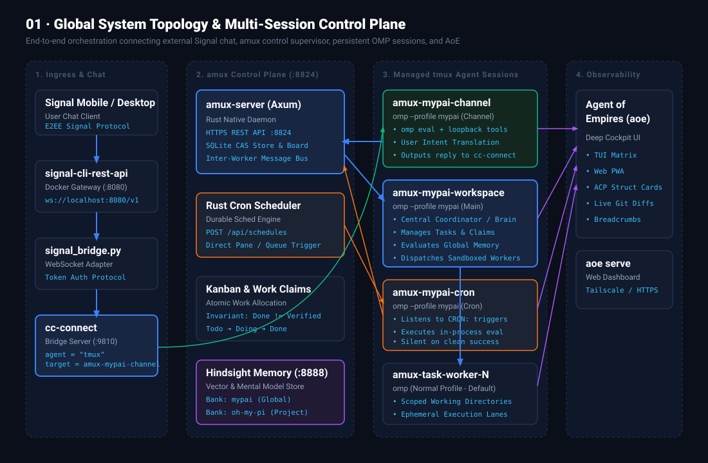
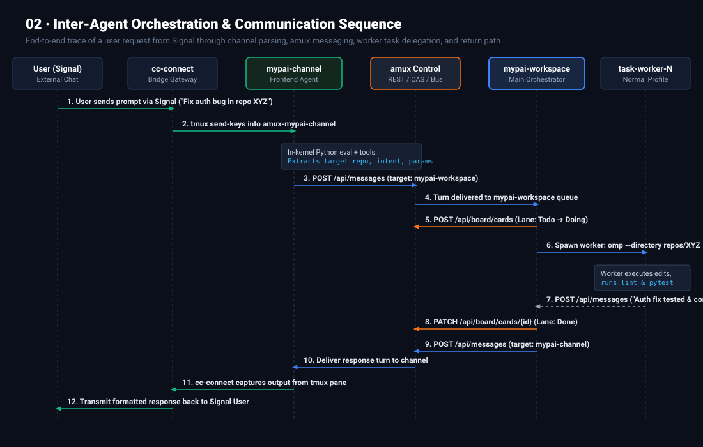
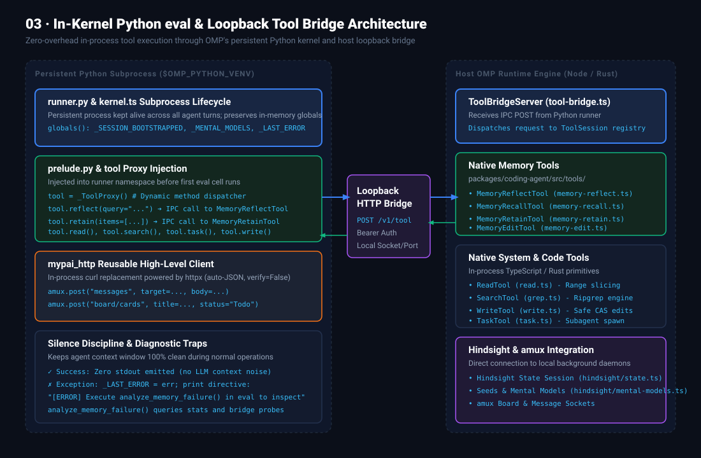
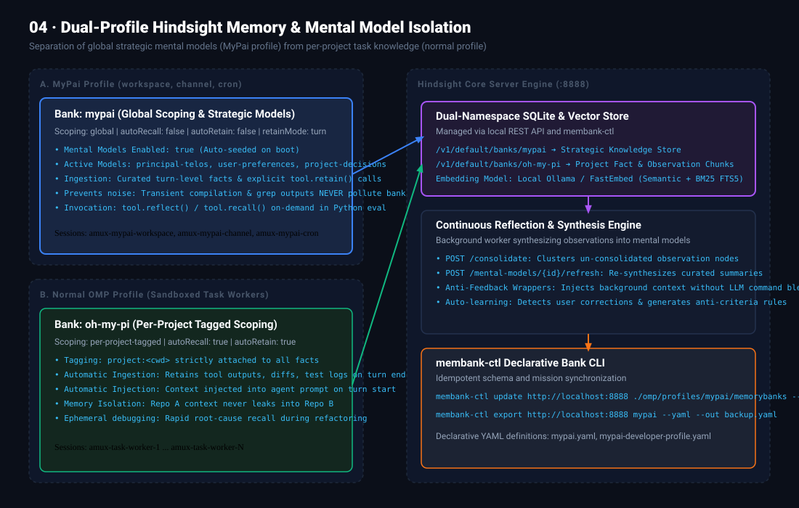
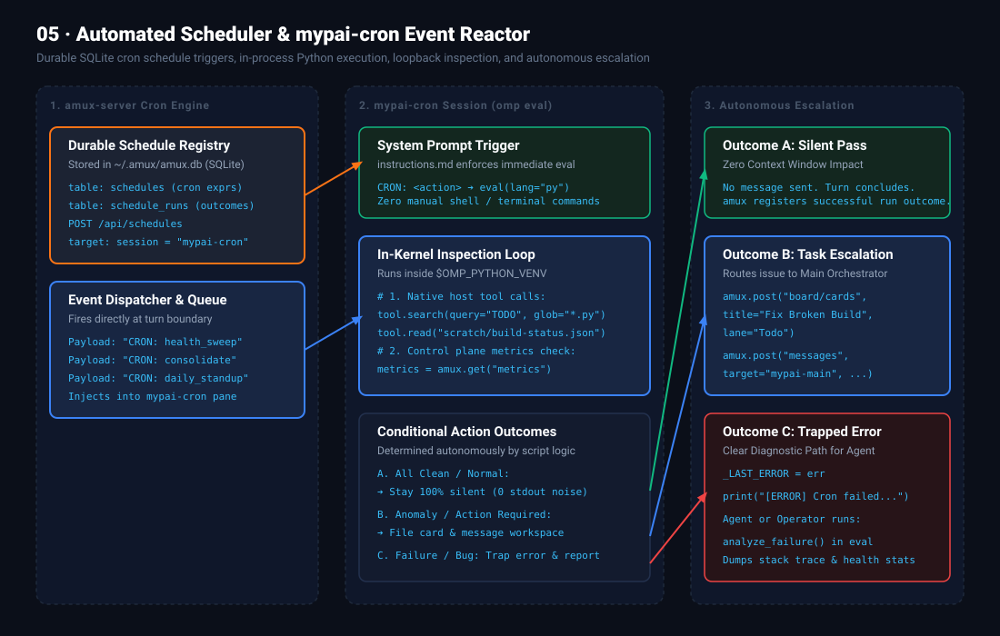

# Next-Generation AI Agent Orchestration Architecture

## Executive Architecture Summary

The Next-Generation MyPai Architecture upgrades the multi-agent system from monolithic bash-scripted workflows into an autonomous, observable, event-driven mesh powered by **`amux`**, **`cc-connect`**, **`oh-my-pi` (`omp`)**, and **`Agent of Empires` (`aoe`)**. 

By strictly leveraging **in-kernel Python `eval` execution** paired with native **loopback tool bridges (`tool.*`)**, the new architecture eliminates shell quoting errors, reduces token context consumption, enforces silent execution discipline, and isolates strategic long-term mental models from project-level task artifacts.

---

## 1. Feature Transfer Matrix: Legacy vs. Next-Gen Architecture

| Architectural Dimension | Legacy Architecture | Next-Gen Architecture | Key Advantage |
| :--- | :--- | :--- | :--- |
| **Control Plane & Process Management** | Ad-hoc background `nohup` scripts / single tmux sessions | `amux` centralized Rust daemon (`amux-server` on port `8824`) | Persistent SQLite state, atomic CAS claims, structured inter-worker message bus (`/api/messages`). |
| **External Ingress & Chat Gateway** | Custom webhooks & manual polling scripts | `cc-connect` WebSocket Bridge (`:9810`) attached to persistent tmux pane | Seamless Signal, Telegram, Discord integration; no sub-agent spawning for frontend chat. |
| **Tool Execution Paradigm** | Subprocess shell calls (`curl`, `bash`, `sed`, `git`) | **In-Kernel Python `eval` (`lang: "py"`) via `_ToolProxy`** | Direct in-process loopback (`tool.read()`, `tool.search()`, `tool.reflect()`), preserving memory state across turns. |
| **HTTP / API Calling Mechanism** | Repetitive bash `curl` commands with string escaping | **High-level `httpx` and `mypai_http` client wrapper** | Automatic JSON serialization, `verify=False` for self-signed certs, persistent base URLs. |
| **Periodic Automation & Scheduling** | Host Linux crontab executing shell scripts | **`amux` Durable Scheduler Engine** targeting dedicated `mypai-cron` session | Turn-boundary prompt injection (`CRON: <action>`), SQLite run auditing, autonomous Kanban card filing. |
| **Long-Term Memory & Mental Models** | Single shared memory bank polluted with build logs | **Dual-Profile Hindsight Memory Isolation** (`mypai` vs `oh-my-pi`) | Strategic mental models stay pure in `mypai`; transient build/debugging facts stay in project-tagged banks. |
| **Observability & Inspection** | Raw terminal scrolling & log tailing | **`Agent of Empires` (`aoe`) Cockpit & Web PWA (`aoe serve`)** | Real-time TUI matrix, ACP structured tool cards, visual git diff review, mobile swipe approval. |
| **Output Token Discipline** | Verbose stdout printing on every intermediate command | **Strict Silence-on-Success Discipline** | 0 token noise on clean runs; automatic exception trapping with `analyze_failure()` debugging path. |

---

## 2. Visual Architectural Blueprints

### Blueprint 01: Global System Topology & Multi-Session Control Plane

**Key Architectural Aspects:**
1. **Single Entry Point (`cc-connect`):** Directs incoming Signal chat into `amux-mypai-channel` without spawning new child sessions.
2. **Central Nervous System (`amux-mypai-main`):** Acts as `@orchestrator` (`mypai main`), coordinating all tasks and delegating work to ephemeral task workers (`amux-task-worker-N`).
3. **Dedicated Automation Lane (`amux-mypai-cron`):** Receives scheduled cron triggers from `amux-server` without blocking interactive chat.
4. **Unified Observability (`aoe`):** Connects to all sessions concurrently over tmux sockets and ACP protocol for live monitoring.

---

### Blueprint 02: Inter-Agent Orchestration & Communication Sequence

**Lifecycle of a User Request:**
1. **User Signal Prompt ➔ `cc-connect`:** Delivered via WebSocket bridge into `amux-mypai-channel`.
2. **Intent Parsing & Translation:** `mypai-channel` runs Python `eval` with loopback tools to extract repository names and intent.
3. **Inter-Worker Dispatch:** Dispatches request to `mypai-main` via `httpx.post("https://localhost:8824/api/messages", ...)`.
4. **Kanban Work Claim:** `mypai-main` moves task card to `Doing`, launches `amux-task-worker-1` with normal `omp` profile.
5. **Task Execution & Verification:** Worker edits files, runs lint/test suites, and reports back.
6. **Return Path:** `mypai-main` transitions card to `Done` and messages `mypai-channel`, which writes the final formatted reply back to Signal.

---

### Blueprint 03: In-Kernel Python `eval` & Loopback Tool Bridge Architecture

**Doubling Down on the `omp` Python `eval` Engine:**
- **Persistent Subprocess:** `runner.py` maintains state in `$OMP_PYTHON_VENV`, preserving `globals()` (`_SESSION_BOOTSTRAPPED`, `_MENTAL_MODELS`, `_LAST_ERROR`).
- **Native Host Tool Proxy (`tool.*`):** `prelude.py` injects `tool = _ToolProxy()`. Calling `tool.reflect()`, `tool.recall()`, `tool.retain()`, `tool.read()`, or `tool.search()` executes host TypeScript/Rust primitives directly via local loopback bridge (`POST /v1/tool`).
- **High-Level HTTP Client (`mypai_http`):** Eliminates bash `curl` boilerplate with pre-configured `amux`, `hindsight`, and `signal` clients.
- **Zero Token Noise:** Successful runs stay completely silent. Trapped exceptions output a concise directive pointing the model to call `analyze_memory_failure()`.

---

### Blueprint 04: Dual-Profile Hindsight Memory & Mental Model Isolation

**Memory Tiering Strategy:**
- **MyPai Profile (`main`, `channel`, `cron`):**
  - Bank: `mypai` | Scoping: `global` | `retainMode: turn` | `autoRecall: false` | `autoRetain: false`.
  - Maintains permanent mental models: `principal-telos`, `user-preferences`, `project-decisions`.
  - Ingestion occurs only via curated, explicit `tool.retain()` calls.
- **Normal Profile (Task Workers):**
  - Bank: `oh-my-pi` | Scoping: `per-project-tagged` | `autoRecall: true` | `autoRetain: true`.
  - Captures tactical codebase details, error logs, and intermediate diffs tagged with `project:<cwd>`.
- **Hindsight Server (:8888):**
  - Handles continuous background consolidation (`/consolidate`) and mental model synthesis (`/mental-models/{id}/refresh`).

---

### Blueprint 05: Automated Scheduler & `amux-mypai-cron` Event Reactor

**Autonomous Cron Execution Loop:**
1. **Durable Trigger:** `amux-server` cron scheduler fires `CRON: <action>` directly into `amux-mypai-cron`.
2. **Immediate Python `eval` Execution:** Agent system prompt directs `mypai-cron` to execute Python `eval` cells without sequential terminal commands.
3. **Loopback Probing:** Inspects file trees, git status, and metrics via `tool.search()`, `tool.read()`, and `amux.get_metrics()`.
4. **Conditional Routing:**
   - **Clean:** Stays 100% silent (0 stdout).
   - **Action Required:** Posts Kanban card (`Todo`) and messages `mypai-main`.
   - **Error:** Traps exception in `_LAST_ERROR` and outputs diagnostic directive.

---

## 3. Core Operational Conventions

1. **Strictly Prefer In-Kernel `eval` over Terminal Commands:**
   All inter-agent communication, API interactions, memory queries, and file inspections should be performed using Python `eval` and loopback `tool.*` proxies.
2. **Always Use `httpx` / `mypai_http` for HTTP:**
   Never invoke raw bash `curl`. Use `amux.get()`, `amux.post()`, or `httpx.Client(verify=False)`.
3. **Enforce Silence on Success:**
   Agent helper scripts must emit zero stdout when operations succeed. Reserve stdout exclusively for actionable user replies or error diagnostics.
4. **Session Spawning Discipline:**
   The `amux` control plane by default only spawns normal-profile `omp` sessions for task workers, keeping the `mypai` profile strictly bound to `workspace`, `channel`, and `cron`.

---

## 4. Extended Analysis & Legacy Comparison

For the full component-by-component comparison with [`submodules/omp-mypai`](file:///home/wuxxin/agent-shared/code/mypai/submodules/omp-mypai) references, see:
- [`research/next-gen-vs-legacy-architecture.md`](file:///home/wuxxin/agent-shared/code/mypai/research/next-gen-vs-legacy-architecture.md)

