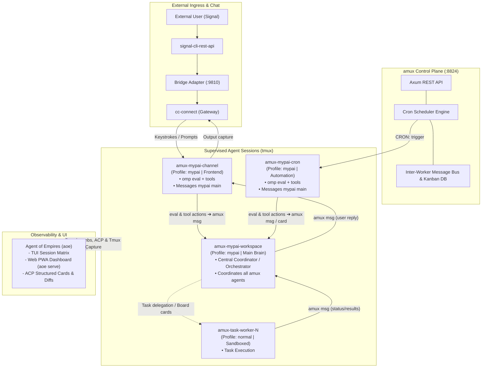

# AI Agent Orchestration Architecture: amux, cc-connect, oh-my-pi & Agent of Empires

## 1. Executive Summary & Core Stack

The multi-agent system combines four specialized components into an autonomous, observable, and multi-channel Linux deployment:

- **`amux` (Control Plane, Scheduler & Process Supervisor):** Manages native `tmux` agent sessions, SQLite event journaling, atomic card claiming, built-in cron schedulers (`/api/schedules`), and inter-worker messaging (`/api/messages`).
- **`cc-connect` (Chat Bridge Gateway):** Provides external multi-platform messaging (Signal, Telegram, Slack, Discord) via WebSocket Bridge protocol and attaches directly to persistent `tmux` agent panes.
- **`oh-my-pi` (`omp`) (Agent Execution Engine):** Runs both as an interactive terminal CLI, a headless tool-using runner, an **ACP (Agent Client Protocol) provider**, and an **in-process Python `eval` engine**. Configured with distinct profiles (`mypai` vs. default `oh-my-pi`).
- **`Agent of Empires` (`aoe`) (Deep Inspector & Visual Cockpit):** Delivers rich TUI and Web PWA (`aoe serve`) monitoring, parsing OMP terminal breadcrumbs (`OMP_PROFILE`, `PI_PROFILE`), plan steps, uncommitted diffs, and structured ACP cards.



## 2. Session Topology & Role Distribution

### Core Sessions Managed by `amux`

`amux` supervises processes inside named `tmux` windows/panes (`amux-<name>`):

1. **`mypai-workspace` (`amux-mypai-workspace`):**
   - **Command:** `omp --profile mypai --directory mypai-workspace`
   - **Role:** Main coordinator / `@orchestrator` brain (`mypai main`). Coordinates all `amux` agents, manages Kanban cards, assigns sub-tasks to workers, and instructs `mypai-channel` when user communication is needed.
2. **`mypai-channel` (`amux-mypai-channel`):**
   - **Command:** `omp --profile mypai --directory mypai-channel`
   - **Role:** Dedicated communication frontend. Listens to user inputs forwarded by `cc-connect`, uses `omp eval` and tools to parse requests, communicates with `mypai-workspace` (`mypai main`) via `amux` messaging, and formats outgoing responses.
3. **`mypai-cron` (`amux-mypai-cron`):**
   - **Command:** `omp --profile mypai --directory mypai-cron`
   - **Role:** Dedicated automation & scheduler executor. Receives timed triggers from `amux` scheduler, evaluates tasks via `omp eval` and in-process tools using the `omp` Python venv, and messages `mypai-workspace` (`mypai main`) with findings, cards, or required escalations.
4. **On-Demand Task Workers (`amux-<task-name>`):**
   - **Command:** `omp --directory <target-repo>` (Normal profile)
   - **Role:** Ephemeral or persistent specialist agents (`@fixer`, `@explorer`, etc.).
   - **Default Policy:** `amux` spawns normal profile `omp` sessions by default, ensuring isolated project sandboxes without mutating global MyPai profiles.

### `amux` Provider Integration (`omp-provider.patch`)

Support for `omp` inside `amux` is enabled via the AUR package patch (`submodules/aur-packages/amux-git/omp-provider.patch`):
- `crates/amux-core/src/provider.rs`: Registers `ProviderId::new("omp")`.
- `crates/amux-server/src/provider/static_providers.rs`: Implements `OmpAdapter` with `build_command` targeting `omp` / `omp exec`.
- `crates/amux-server/src/api/session_verbs.rs`: Maps `launch_base_binary("omp") -> "omp"`.

## 3. Detailed Component Connection Matrix (Who Connects to Whom & How)

The following matrix defines the exact network protocol, socket, endpoint, and mechanism linking each component in the system:

| Origin / Client | Target Session or Service | Connection Mechanism & Protocol | Direction / Payload |
| :--- | :--- | :--- | :--- |
| **Signal User** | `signal-cli-rest-api` | Signal Protocol (E2EE) on port `8080` | Inbound / Outbound messages |
| **`signal-cli-rest-api`** | `signal_bridge.py` | WebSocket stream (`ws://localhost:8080/v1/receive/...`) | JSON event stream of raw Signal envelopes |
| **`signal_bridge.py`** | `cc-connect` | WebSocket Bridge Protocol (`ws://localhost:9810/bridge/ws`) | Standardized bridge message framing |
| **`cc-connect`** | **`amux-mypai-channel`** | Native `tmux` driver (`session="amux-mypai-channel"`, `pane="0"`) | **Inbound:** `tmux send-keys`<br/>**Outbound:** `tmux capture-pane` polling |
| **`amux-mypai-channel`** | **`amux-mypai-workspace`** (`mypai main`) | Axum REST API via in-process `httpx` (`https://localhost:8824/api/messages`) | POST JSON payload with target `mypai-workspace` |
| **`amux Scheduler`** | **`amux-mypai-cron`** | `amux-server` Rust scheduler daemon / steering queue | Direct prompt delivery (`CRON: <action>`) into session pane |
| **`amux-mypai-cron`** | **`amux-mypai-workspace`** (`mypai main`) | Axum REST API via in-process `httpx` (`https://localhost:8824/api/messages` & `/api/board/cards`) | Status notifications, task dispatches, and Kanban cards |
| **`amux-mypai-workspace`** (`mypai main`) | **`amux-mypai-channel`** | Axum REST API via in-process `httpx` (`https://localhost:8824/api/messages`) | User-facing responses to be output on channel pane |
| **`amux-mypai-workspace`** (`mypai main`) | **`amux-task-worker-N`** | Axum REST API (`/api/sessions`, `/api/board/cards`, `/api/messages`) | Spawns normal-profile workers, claims cards, assigns sub-tasks |
| **`amux-task-worker-N`** | **`amux-mypai-workspace`** (`mypai main`) | Axum REST API (`/api/messages`, `/api/board/cards/{id}`) | Task completion reports, diff confirmations, card status updates |
| **All `omp` Sessions** | **Hindsight Service** | HTTP REST API on `http://localhost:8888` | Turn retention (`/retain`), recall (`/recall`), mental model reflection |
| **`Agent of Empires` (`aoe`)** | **All `amux-*` Sessions** | **1. Tmux Introspection:** Terminal breadcrumbs (`session/capture/omp.rs`)<br/>**2. ACP Protocol:** stdio/IPC when `omp` runs in `omp acp` mode | Deep live inspection, TUI matrix navigation, Web PWA dashboard (`aoe serve`) |

### Connection Deep-Dive by Agent Session

1. **`amux-mypai-channel` (Communication Gateway):**
   - **Connected FROM:** `cc-connect` via tmux PTY/pane injection (`tmux send-keys`).
   - **Connects TO:** `amux-mypai-workspace` via HTTP POST to `https://localhost:8824/api/messages` executed from `omp eval` using `httpx` / `mypai_http`.
   - **Connects TO:** `Hindsight` on `http://localhost:8888` for contextual user preference queries.

2. **`amux-mypai-cron` (Timed Automation Engine):**
   - **Connected FROM:** `amux-server` background scheduler loop via direct prompt injection.
   - **Connects TO:** `amux-mypai-workspace` via HTTP POST (`/api/messages` and `/api/board/cards`) from `omp eval` using `httpx`.
   - **Connects TO:** Host filesystem and git repos via `omp` loopback bridge (`tool.read`, `tool.search`).

3. **`amux-mypai-workspace` (`mypai main` / Orchestrator):**
   - **Connected FROM:** `amux-mypai-channel` and `amux-mypai-cron` via the `amux` message bus.
   - **Connects TO:** `amux-task-worker-N` by spawning them via `amux-server` session endpoints and dispatching Kanban cards.
   - **Connects TO:** `amux-mypai-channel` via `POST /api/messages` when user interaction or confirmation is required.
   - **Connects TO:** `Hindsight` (`bankId: mypai`) for strategic reflection and mental model tracking.

4. **`amux-task-worker-N` (Execution Workers):**
   - **Connected FROM:** `amux-mypai-workspace` via amux Kanban board cards and inter-worker messages.
   - **Connects TO:** Target codebase directories with normal `omp` profiles and isolated project Hindsight banks.
   - **Observed BY:** `Agent of Empires` (`aoe`) for real-time diff analysis and tool-call step tracking.

## 4. Communication & Control Flows

### Inbound Message Flow (User ➔ Agent)
1. The user sends a message via Signal.
2. `signal-cli-rest-api` emits a webhook event to `signal_bridge.py`.
3. `signal_bridge.py` forwards the message over WebSocket (`ws://localhost:9810/bridge/ws`) to `cc-connect`.
4. `cc-connect` (configured with `agent = "tmux"` and `session = "amux-mypai-channel"`) writes keystrokes into the persistent `mypai-channel` tmux pane.

### Inter-Agent Orchestration Loop (eval ➔ amux msg ➔ mypai main)
1. `mypai-channel` receives user input, executes an in-process `eval` / tool pass to parse intent and extract structured metadata.
2. `mypai-channel` dispatches instructions to `mypai-workspace` (`mypai main`) via `amux` REST API:
   ```python
   import httpx

   httpx.post(
       "https://localhost:8824/api/messages",
       json={
           "target": {"worker_name": "mypai-workspace"},
           "body": "User requested refactoring of auth module in repo XYZ"
       },
       verify=False
   )
   ```
3. Similarly, `mypai-cron` receives periodic `CRON:` triggers, executes `eval` + loopback tools (checking repo states, APIs, metrics), and dispatches reports or files task cards to `mypai-workspace`.
4. `mypai-workspace` (`mypai main`) receives message turns from both `channel` and `cron`, updates the amux board (`POST /api/board/cards`), claims tasks, and invokes worker sessions (`omp --directory repos/XYZ`).
5. Workers execute actions, reporting progress and results back to `mypai-workspace`.

### Outbound Notification Flow (Agent ➔ User)
1. `mypai-workspace` completes the job or requires user confirmation.
2. `mypai-workspace` sends an amux message targeting `mypai-channel`.
3. `mypai-channel` crafts the user-facing response and outputs it to its terminal.
4. `cc-connect` captures the output from `amux-mypai-channel` pane and transmits the response back through `signal_bridge.py` ➔ `signal-cli-rest-api` ➔ Signal.


## 5. `amux` Scheduler Architecture & `mypai-cron` Execution Engine

### Scheduler Scoping: Global Daemon vs. Targeted Sessions
- **Architecture:** The `amux` scheduler is a **global, SQLite-backed background daemon engine** hosted inside `crates/amux-server/src/runtime_jobs/scheduler.rs`.
- **Targeting:** While the schedule registry is global across the entire `amux` server, individual schedule entries are **scoped directly to specific target agent sessions** via the `session` (or `worker`) field, or set to `kind = "shell"` for unattached jobs:
  - When a session-bound schedule fires, `amux` delivers the command/prompt directly to the targeted worker's turn boundary (or steering queue).
  - To prevent queue collisions and latency in interactive or main orchestration lanes, all periodic and timed cron jobs target the dedicated **`mypai-cron`** session (`amux-mypai-cron`).

### Schedule Definition via `amux` REST API
Periodic tasks are registered with standard cron syntax via Python `eval`:
```python
import httpx

httpx.post(
    "https://localhost:8824/api/schedules",
    json={
        "title": "Hourly Health & Git Sweep",
        "session": "mypai-cron",
        "schedule_expr": "0 * * * *",
        "command": "CRON: health_sweep repo=/path/to/project alert_threshold=warn",
        "enabled": True
    },
    verify=False
)
```

### `CRON:` Protocol & `omp eval` Tool Loop
When the `amux` scheduler fires, it sends `CRON: <action> [params...]` to `mypai-cron`. The agent in `mypai-cron` is steered via system instructions to immediately execute an in-process Python script using `omp`'s persistent **`eval` tool** (`lang: "py"`).

#### Advantages of the `omp eval` Python Kernel:
1. **Runs in `omp`'s Virtualenv:** Uses `$OMP_PYTHON_VENV`, giving direct access to full Python network/data tooling (`httpx`, `requests`, `sqlite3`, `pydantic`).
2. **Loopback Bridge:** Programmatically invokes native `omp` tools (`tool.read()`, `tool.write()`, `tool.search()`, `tool.task()`) from Python code without dumping intermediate payload tokens into the LLM context.
3. **Session State Persistence:** Reuses in-memory connections, pre-loaded modules, and helper libraries across recurring cron runs.

### `omp eval` HTTP Tooling & Library Selection

To replace raw terminal `curl` invocations with clean, in-process Python calls inside `omp eval`, **`httpx`** is selected as the primary HTTP client:
- **Concise Ergonomics:** Automatic JSON serialization (`json={...}`) and response decoding (`.json()`).
- **TLS Flexibility:** Clean self-signed SSL bypassing via `verify=False` (vital for `amux` HTTPS on port `8824`).
- **Persistent Sessions:** Supports `httpx.Client(base_url="...")` to avoid repeating root URLs across turns.

#### Reusable Client Helper (`mypai_http.py`)
Placed inside `$OMP_PYTHON_VENV` or the agent workspace root:

```python
import httpx

class APIClient:
    def __init__(self, base_url: str, verify: bool = False, headers: dict = None):
        self.client = httpx.Client(base_url=base_url, verify=verify, headers=headers or {})

    def get(self, path: str, **kwargs) -> dict:
        return self.client.get(path, **kwargs).json()

    def post(self, path: str, data: dict = None, **kwargs) -> dict:
        return self.client.post(path, json=data or kwargs).json()

# Pre-configured global clients
amux = APIClient("https://localhost:8824/api", verify=False)
hindsight = APIClient("http://localhost:8888", verify=True)
signal = APIClient("http://localhost:8080/v2", verify=True)
```

### `mypai-cron` Instruction & Helper Prelude

#### System Prompt / Instructions (`mypai-cron/.omp/instructions.md`)
```markdown
# MyPai Cron Agent System Instructions

## CRON Trigger Protocol
When you receive a message starting with `CRON: <action>`, you MUST NOT make sequential terminal or manual tool calls. Instead, immediately execute an `eval` cell with `lang: "py"` handling the event.

### Built-in Helper Functions available in Python `eval`
The following standard helpers are available from `mypai_http`:
- `amux.post("messages", target={"worker_name": "mypai-workspace"}, body="...")`: Sends inter-worker messages to `mypai-workspace` or `mypai-channel`.
- `amux.post("board/cards", title="...", description="...", status="Todo")`: Creates Kanban cards on amux board.
- `hindsight.get("memorybanks/mypai/recall", params={"q": "..."})`: Queries Hindsight memory.
- `signal.post("send", number="+12345", recipients=["+12345"], message="...")`: Outbound Signal notification.

### Action Handlers
- `CRON: health_sweep`: Run git status / build checks across workspaces; if failures occur, file an amux card and message `mypai-workspace`.
- `CRON: memory_consolidation`: Trigger Hindsight `/consolidate` and mental model refresh endpoints.
- `CRON: daily_standup`: Collect completed task cards from amux API and instruct `mypai-channel` to post summary to Signal.
```

#### Example: In-Kernel Execution for `CRON: health_sweep`
```python
from mypai_http import amux, hindsight

# 1. Inspect repo state via native omp loopback bridge
changes = tool.search(query="TODO", glob="*.py")
uncommitted = tool.read("scratch/build-status.json")

# 2. Check amux server metrics via high-level HTTP client
metrics = amux.get("metrics")

# 3. If anomaly detected, dispatch card and notify mypai-workspace
if metrics.get("failed_runs", 0) > 0:
    amux.post(
        "board/cards",
        title="Investigate Failed Runs",
        description=f"Detected {metrics['failed_runs']} failed scheduled jobs",
        status="Todo"
    )
    amux.post(
        "messages",
        target={"worker_name": "mypai-workspace"},
        body=f"CRON health_sweep: {metrics['failed_runs']} jobs failed. Card filed."
    )

print("CRON: health_sweep completed successfully.")
```

## 6. Integration of Agent of Empires (`aoe`)

`aoe` serves as the **deep inspector, visual cockpit, and mobile approval UI**:

### Coexistence with `amux`
- `amux` owns process lifecycle, daemon persistence, scheduling, and inter-worker routing.
- `aoe` connects in read/interactive inspection mode without conflicting with `amux`'s process supervisory loop:
  - **TUI Matrix:** Live keyboard navigation across all `amux-*` sessions via SSH.
  - **Web PWA Dashboard:** `aoe serve` enables remote browser access over Tailscale/local network.
  - **Breadcrumb Parser (`session/capture/omp.rs`):** Natively parses OMP session files, environment variables (`OMP_PROFILE`, `PI_PROFILE`), active tool calls, and uncommitted git diffs.
  - **ACP Structured View:** When running OMP in ACP provider mode (`omp acp`), `aoe` renders interactive tool approval cards, plan hierarchies, and token usage analytics.

## 7. Hindsight Memory Architecture: Profile Isolation

Hindsight vector memory and mental model reflection behave differently across profiles:

| Dimension | Default Profile (`~/.omp/agent/config.yml`) | MyPai Profile (`~/.omp/profiles/mypai/config.yml`) |
| :--- | :--- | :--- |
| **`hindsight.bankId`** | `oh-my-pi` | `mypai` |
| **`hindsight.scoping`** | `per-project-tagged` | `global` |
| **`hindsight.retainMode`** | `full-session` | `turn` |
| **`hindsight.autoRecall`** | `true` | `false` (explicit/directed recall) |
| **`hindsight.autoRetain`** | `true` | `false` (curated knowledge ingestion) |
| **`hindsight.mentalModelsEnabled`**| `true` | `true` |
| **`hindsight.mentalModelAutoSeed`**| `true` | `true` |

- **Default Profile (Task Workers):** Uses automated recall and retention scoped per project to capture codebase specifics and transient debugging steps.
- **MyPai Profile (`workspace`, `channel`, `cron`):** Uses global mental models (`principal-telos`, `user-preferences`, `project-decisions`), disabling unguided auto-retention to keep the primary memory bank clean from task-level noise.

### Native `omp` Internal Memory Tools (Loopback Bridge)

In `oh-my-pi`, memory operations are exposed natively as host tools rather than requiring manual HTTP calls. When executing code in `omp eval` (`lang: "py"`), the `prelude.py` runtime injects the `tool` proxy, enabling direct, in-process invocation:

- **`tool.reflect(query="...", context="...")`**: Synthesizes structured answers from long-term memory and mental models using the active backend (`MemoryReflectTool`).
- **`tool.recall(query="...")`**: Performs semantic hybrid search across stored facts (`MemoryRecallTool`).
- **`tool.retain(items=[{"content": "...", "context": "..."}])`**: Persists observations and memories into long-term storage (`MemoryRetainTool`).

### In-Kernel Hindsight Lifecycle Pattern using Native `omp` Tools

The following pattern demonstrates a complete session turn lifecycle using **only internal `omp` tools** via the loopback bridge:
1. **Session Start Detection:** Checks if the kernel is bootstrapped. If first turn, queries the `user-preferences` and `project-conventions` mental models via `tool.reflect()`.
2. **Contextual Action:** Combines incoming input and recalled mental models.
3. **Turn Retention:** Persists the turn outcome using native `tool.retain()`.
4. **Clean Silence Discipline:** If successful, outputs nothing (zero context pollution). If an error occurs, traps the exception and outputs an alert directing the agent to invoke `analyze_memory_failure()`.

```python
# Diagnostic helper available in persistent kernel namespace
def analyze_memory_failure():
    """Inspects the trapped error and tests native memory tool availability."""
    last_err = globals().get("_LAST_ERROR", "No trapped error recorded.")
    print(f"--- MEMORY PIPELINE DIAGNOSTIC REPORT ---\nLast Error: {last_err}\n")
    try:
        test_probe = tool.recall(query="ping health probe")
        print(f"Loopback Bridge Probe: OK -> {test_probe}")
    except Exception as bridge_err:
        print(f"Memory Tool Bridge Error: {bridge_err}")

try:
    # 1. Session-start bootstrap: Recall mental models on first turn via native tool
    if "_SESSION_BOOTSTRAPPED" not in globals():
        # Call omp's native reflect tool to fetch active mental model summary
        mental_model_context = tool.reflect(
            query="Summarize active user preferences, principal telos, and core project conventions."
        )
        _MENTAL_MODELS = mental_model_context
        _SESSION_BOOTSTRAPPED = True

    # 2. Process input with recalled mental model guidelines
    input_text = "Verify database connection pool parameters."
    # (Agent in-process processing, analysis, or sub-tool calls here...)

    # 3. Retain turn observation using omp's native retain tool
    tool.retain(items=[{
        "content": f"Turn Summary: Processed '{input_text}' under active mental models. Outcome: Connection pool validated.",
        "context": "mypai-workspace:turn-execution"
    }])

    # 4. Success: Stay completely silent (no stdout) to prevent context pollution

except Exception as err:
    # Trap error in kernel state and output directive
    _LAST_ERROR = err
    print(f"[ERROR] Native memory tool pipeline failed: {err}. Execute `analyze_memory_failure()` in Python eval to inspect.")
```

## 8. Implementation Reference: `cc-connect` Config

### `~/.cc-connect/config.toml`

```toml
data_dir = "~/.cc-connect"

[log]
level = "info"

[display]
mode = "quiet"
thinking_messages = false
tool_messages = false
show_context_indicator = false
reply_footer = false

[bridge]
enabled = true
port = 9810
path = "/bridge/ws"
token = "mypai-bridge-token"

[[projects]]
name = "mypai-channel"
reset_on_idle_mins = 0
agent_session_idle_timeout_mins = 0

[projects.agent]
type = "tmux"

[projects.agent.options]
session = "amux-mypai-channel"
pane = "0"
auto_create = false
prompt_pattern = "[❯\\$#>%]\\s*$"
poll_interval_ms = 200

[[projects.platforms]]
type = "bridge"
```

