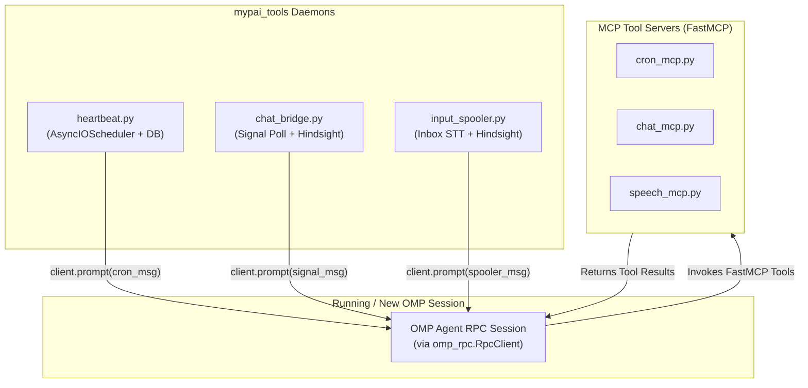

# Research: Headless Execution, RPC Steering & `mypai_tools` Daemon Injection

## Executive Summary

This document provides a comprehensive research analysis of **headless execution and RPC steering** in `oh-my-pi` (`omp`), along with a detailed breakdown of how **`mypai_tools` background daemons** monitor events and inject prompts/events into a running or new `omp` RPC session.

All daemon-to-agent communication **mandatorily uses the official Python `omp_rpc.RpcClient` library** (`from omp_rpc import RpcClient`), formatting event payloads into customized prompt messages that are queued directly into `omp` session turns.

---

## 1. OMP Headless Execution & Mandatory `omp_rpc.RpcClient`

### 1.1 Headless Execution Mode (`omp --mode rpc`)
Headless operation runs the agent as a JSON-RPC subprocess over `stdio` (or an exposed socket endpoint):
```bash
omp --mode rpc --provider <provider> --model <model> [options]
```

#### Protocol & Client Standards
- **Standard Client**: Python `omp_rpc.RpcClient` handles process management, stdio JSONL framing, protocol v2 negotiation (`negotiate_protocol`), and chunk reassembly (`rpc_chunk`).
- **Headless UI Policy**: Interactive prompts (confirmations, inputs) are automated via `client.install_headless_ui()`, preventing process stalls when running headlessly.

---

### 1.2 Session Injection Mechanics & `RpcClient` Methods

Daemons inject customized prompt messages into a running RPC server using official `RpcClient` methods:

```python
from omp_rpc import RpcClient

with RpcClient() as client:
    client.install_headless_ui()
    # Queue prompt into running session
    client.prompt("Customized daemon message with event data...")
```

| Injection Method | `RpcClient` Call | Behavior & Queueing |
| :--- | :--- | :--- |
| **New Prompt** | `client.prompt(message)` | Submits a new prompt. Acknowledged immediately; streams events until turn completion (`agent_end`). |
| **Steer (Interrupt)** | `client.steer(message)` | Injects an immediate steering message mid-turn to interrupt tool execution between tool calls. |
| **Follow-Up** | `client.follow_up(message)` | Queues a message to execute immediately after the current turn completes. |
| **Abort & Prompt** | `client.abort_and_prompt(message)` | Aborts ongoing agent turns and begins processing the new prompt immediately. |
| **Switch Session** | `client.switch_session(path)` | Loads a saved session file (`.omp/sessions/...`) into the running server. |
| **Branch Session** | `client.branch(entry_id)` | Branches context from a specific entry ID. |

---

### 1.3 Queueing Modes & Concurrency Controls

`omp` RPC provides granular concurrency controls over how injected messages are processed:

1. **`steeringMode`** (`"one-at-a-time"` vs `"all"`):
   - `"one-at-a-time"`: Dequeues one queued steering message per turn.
   - `"all"`: Dequeues all pending steering messages simultaneously into the turn context.
2. **`followUpMode`** (`"one-at-a-time"` vs `"all"`):
   - Controls how follow-up messages are consumed upon turn completion.
3. **`interruptMode`** (`"immediate"` vs `"wait"`):
   - `"immediate"`: Tool execution checks for incoming steering messages between tool calls. Pending steering aborts remaining tool calls in the active turn.
   - `"wait"`: Defers steering evaluation until the entire active turn finishes.

---

## 2. Analysis of `mypai_tools` Daemon Injection Pipeline

The `mypai_tools` suite (`submodules/omp-mypai/tools/mypai_tools/`) contains background daemons and MCP tool servers designed to operate headlessly and communicate with `omp` using `omp_rpc.RpcClient`.



---

### 2.1 Daemon 1: `heartbeat.py` (Scheduler & Cron Injector)

#### Functionality
- Runs an `AsyncIOScheduler` daemon tied to a per-project SQLite database (`~/.omp/cron/projects/<project_hash>/cron.db`).
- Tracks daemon vitality using a PID file (`heartbeat.pid`).
- Periodically queries enabled jobs every 10 seconds (`DEFAULT_DB_SYNC_INTERVAL_SEC`).

#### RpcClient Injection Implementation
When a scheduled cron job triggers, `heartbeat.py` formats a **customized interpretation prompt** and queues it into `omp` via `omp_rpc.RpcClient`:

```python
from omp_rpc import RpcClient

def execute_cron_rpc_job(job_name: str, job_id: str, job_prompt: str, target_channel: str) -> None:
    custom_message = (
        f"[Scheduled Cron Job: {job_name} (ID: {job_id})]\n"
        f"Prompt Directive: {job_prompt}\n"
        f"Target Channel: {target_channel}\n\n"
        f"Instruction: Execute the requested job directive and dispatch output to the target channel."
    )
    with RpcClient() as client:
        client.install_headless_ui()
        client.prompt(custom_message)
```

---

### 2.2 Daemon 2: `chat_bridge.py` (Signal Gateway RPC Bridge)

#### Functionality
- Continuously polls incoming Signal messages from the Nanobot Signal Gateway or `signal-cli-rest-api` (`http://localhost:50889` or `http://localhost:8790`).
- Extracts sender number, message text, and timestamp.

#### Memory Recall & RpcClient Injection Mechanics
1. **Context Recall**: Queries Hindsight REST API (`http://localhost:8888/v1/default/banks/omp-orchestrator/recall`) to retrieve relevant sender/global memory context.
2. **RpcClient Prompt Queueing**: Constructs a **customized interpretation prompt** and queues it into the active `omp` session:

```python
from omp_rpc import RpcClient

def process_signal_message(sender: str, message_text: str, context: str) -> None:
    custom_message = (
        f"[Signal Message Inbound]\n"
        f"Sender: {sender}\n"
        f"Message: {message_text}\n"
        f"Recalled Memory Context:\n{context}\n\n"
        f"Instruction: Evaluate this message using the recalled context and use the "
        f"send_signal_message tool from chat-channel to reply if needed."
    )
    with RpcClient() as client:
        client.install_headless_ui()
        # Queue the message into the running session turn
        turn = client.prompt_and_wait(custom_message)
        logger.info("Agent turn completed: %s", turn.require_assistant_text())
```

3. **Response Dispatch**: Takes the returned assistant text and sends it back to the sender via `send_signal_message` (`chat_mcp` or `signal-cli` `/v2/send`).

---

### 2.3 Daemon 3: `input_spooler.py` (Ingestion & Transcription Spooler)

#### Functionality
- Monitors an inbox folder (`~/Recordings/Inbox`).
- Applies **quiescence gating**: ensures file size remains unchanged for 10.0 seconds before processing.
- Computes SHA256 content hashes to avoid duplicate processing.
- Parses markdown sidecar metadata files (`<filename>.md`) for title/type tags.
- For audio/video files, calls the local Whisper Speech-to-Text service (`http://localhost:50090/v1/audio/transcriptions`).
- Posts transcripts and metadata into Hindsight memory banks (`omp-orchestrator`).

#### RpcClient Event Notification
When a file ingestion succeeds, `input_spooler.py` notifies the active `omp` session using `omp_rpc.RpcClient`:

```python
from omp_rpc import RpcClient

def notify_omp_spooler_ingestion(
    file_name: str, item_hash: str, item_type: str, title: str, transcript: str, bank_id: str
) -> None:
    custom_message = (
        f"[Ingestion Spooler Event]\n"
        f"File: {file_name} (SHA256: {item_hash[:12]})\n"
        f"Type: {item_type} | Title: {title}\n"
        f"Transcript:\n{transcript}\n\n"
        f"Memory Status: Retained to Hindsight bank '{bank_id}'.\n"
        f"Instruction: Acknowledge ingestion and take any follow-up actions if required."
    )
    with RpcClient() as client:
        client.install_headless_ui()
        client.prompt(custom_message)
```

---

### 2.4 FastMCP Tool Servers (`cron_mcp.py`, `chat_mcp.py`, `speech_mcp.py`)

These FastMCP tool servers run alongside `omp` over `stdio` transport:

1. **`cron_mcp.py`**:
   - Exposes tools to list, add, pause, resume, and delete cron jobs in SQLite `cron.db`.
   - Exposes `is_heartbeat_running()` to report `heartbeat.py` daemon status.
2. **`chat_mcp.py`**:
   - Exposes `get_pending_signal_messages`, `send_signal_message`, and `list_signal_chats` to interact with `signal-cli`.
3. **`speech_mcp.py`**:
   - Exposes `transcribe_audio` (Whisper STT port 50090) and `synthesize_speech` (Qwen3 TTS port 50095).

---

## 3. Summary of How `mypai_tools` Injects into `/new` Sessions

When starting a `/new` session or queueing work into an active RPC agent:
1. **Event Detection**: Daemons (`heartbeat.py`, `chat_bridge.py`, or `input_spooler.py`) detect a scheduled cron, inbound Signal message, or new inbox file.
2. **Memory Context Enrichment**: Daemons query Hindsight (`http://localhost:8888`) for historical context.
3. **`RpcClient` Prompt Queueing**: Daemons instantiate `omp_rpc.RpcClient()`, set `install_headless_ui()`, and call `client.prompt(customized_message)`.
4. **Agent Processing & Tool Execution**: `omp` receives the customized prompt, interprets the data, executes MCP tools (via `chat_mcp`, `speech_mcp`, or system tools), and generates output.
5. **Response Dispatch**: Daemons capture the response and dispatch results back to external channels (e.g. Signal).
