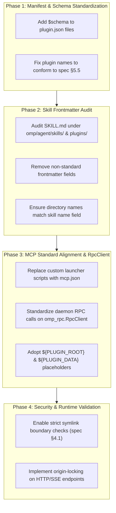

# Architecture Plan: Modifying mypai Components to Conform to Agent Plugins 1.0.0 Standard

## Executive Summary

This document details the architectural modifications required to transition **`mypai`** plugins, skills, tools, and MCP servers to full compliance with the **Agent Plugins 1.0.0 Standard** ([agent-plugins.org](https://agent-plugins.org)) and the **Agent Skills Specification** ([agentskills.io](https://agentskills.io/specification)).

All inter-process communication between `mypai` background services/daemons and `omp` (oh-my-pi) **mandatorily uses the official `omp_rpc.RpcClient` Python library**, queueing customized prompt messages into active or new `omp` sessions.

---

## 1. Overview of the Agent Plugins 1.0.0 Standard

The Agent Plugins 1.0.0 standard defines a portable package format for AI agent extensions. A compliant plugin directory contains:
- **`plugin.json`**: Root manifest defining metadata and capabilities.
- **`mcp.json`**: Standardized Model Context Protocol (MCP) server definitions.
- **`skills/<skill-name>/SKILL.md`**: Portable skill packages governed by the closed 6-field Agent Skills frontmatter specification.

### Key Specification Requirements
1. **Canonical Schemas**: Mandatory `$schema` identifiers for `plugin.json` and `mcp.json`.
2. **Closed Schema Validation**: Rejection or warning on unexpected top-level fields; strict naming rules for plugins and skills.
3. **Package Boundary Containment (Spec §4.1)**: Protection against directory traversal (`..`) and escaping symlinks outside `${PLUGIN_ROOT}`.
4. **Variable Placeholders (Spec §9.2)**: Portable substitution of `${PLUGIN_ROOT}` and `${PLUGIN_DATA}`.
5. **Origin Locking (Spec §7.2.1)**: HTTP/SSE MCP authorization header isolation across domain origins.

---

## 2. Audit of Current `mypai` Structure

Current `mypai` customization locations:
- `omp/agent/skills/` (`arbor`, `mypai-tools`, `hindsight-api`, `sequential-thinking`, `openadapt`)
- `omp/plugins/`
- `.agents/`
- Global plugins in `~/.gemini/config/plugins/` (`android-cli-plugin`, `modern-web-guidance-plugin`)

### Identified Compliance Gaps
1. **Missing Manifest Schemas**: `plugin.json` files omit `$schema` declarations (`https://agent-plugins.org/schemas/1.0.0/plugin.schema.json`).
2. **Non-Standard Skill Frontmatter**: Several `SKILL.md` files contain non-standard frontmatter fields (e.g. `author`, `tags`, custom metadata) violating the closed 6-field `SKILL.md` spec.
3. **Directory/Skill Name Mismatches**: Skill directory names must strictly match the `name:` key inside `SKILL.md` (NFKC normalized lowercase).
4. **Ad-Hoc MCP Configurations**: MCP servers are declared via custom shell scripts or framework-specific configs rather than a standard `mcp.json`.
5. **Hardcoded Paths**: Relative or hardcoded filesystem paths used instead of standard `${PLUGIN_ROOT}` and `${PLUGIN_DATA}` placeholders.

---

## 3. Required Modifications for `mypai`

### 3.1 Modification 1: Standardize `plugin.json` Manifests

Every plugin root must contain a conformant `plugin.json` referencing the canonical `$schema`.

#### Specification Rules (Spec §5)
- **`$schema`**: Must be `"https://agent-plugins.org/schemas/1.0.0/plugin.schema.json"`.
- **`name`**: 1–64 characters, lowercase `a-z0-9`, hyphens `-`, dots `.`. Cannot start/end with hyphens or contain `--` / `..`.

#### Before & After Example

**Before (`plugins/android-cli-plugin/plugin.json`):**
```json
{
  "name": "android-cli-plugin",
  "version": "1.0.15985488",
  "description": "Core tools and knowledge required to develop for Android"
}
```

**After (Agent Plugins 1.0.0 Compliant):**
```json
{
  "$schema": "https://agent-plugins.org/schemas/1.0.0/plugin.schema.json",
  "name": "mypai-android-cli",
  "version": "1.0.0",
  "description": "Core tools and knowledge required to develop for Android",
  "author": {
    "name": "Android Developer Tools Team"
  },
  "license": "Apache-2.0",
  "keywords": ["android", "mobile", "sdk", "device"]
}
```

---

### 3.2 Modification 2: Create Standardized `mcp.json` Files

Plugins that expose tools via MCP (such as `nanobot-signal-mcp` or database/search tools) must declare them in `mcp.json`.

#### Specification Rules (Spec §7.2)
- **`$schema`**: Must be `"https://agent-plugins.org/schemas/1.0.0/mcp.schema.json"`.
- Supports `stdio` and `sse` (or HTTP) transport types.
- Auto-expands `${PLUGIN_ROOT}` and `${PLUGIN_DATA}` in environment variables and arguments.

#### Example: `mcp.json` for Signal / Custom MCPs
```json
{
  "$schema": "https://agent-plugins.org/schemas/1.0.0/mcp.schema.json",
  "mcpServers": {
    "chat-channel": {
      "type": "stdio",
      "command": "python",
      "args": ["-m", "mypai_tools.chat_mcp"],
      "env": {
        "SIGNAL_DAEMON_URL": "http://127.0.5.1:50888",
        "PLUGIN_DATA": "${PLUGIN_DATA}"
      }
    }
  }
}
```

---

### 3.3 Modification 3: Enforce `SKILL.md` Closed Frontmatter Schema

All `SKILL.md` files must strictly conform to the closed frontmatter specification ([agentskills.io](https://agentskills.io/specification)).

#### Closed Frontmatter Fields (Max 6 Allowed)
1. **`name`** *(required)*: Lowercase string matching directory name (max 64 chars).
2. **`description`** *(required)*: String describing skill purpose (max 1024 chars).
3. **`license`** *(optional)*: String (e.g. `"MIT"` or `"Apache-2.0"`).
4. **`allowed-tools`** *(optional)*: Space-delimited string of allowed tools.
5. **`metadata`** *(optional)*: Map of string keys to string values.
6. **`compatibility`** *(optional)*: String (max 500 chars).

*Any extra frontmatter key (such as `author`, `tags`, `category`) causes a fatal validation rejection under Agent Plugins §7.1.*

#### Before & After Example

**Before (`omp/agent/skills/mypai-tools/SKILL.md`):**
```yaml
---
name: mypai-tools
description: Helper scripts for mypai workflow
author: mypai
tags: [tools, workflow]
custom_setting: true
---
```

**After (Agent Plugins 1.0.0 Compliant):**
```yaml
---
name: mypai-tools
description: Helper scripts for mypai workflow
license: MIT
metadata:
  author: mypai
  category: workflow
---
```

---

### 3.4 Modification 4: Mandatory `omp_rpc.RpcClient` Integration

All `mypai` background services and daemons communicate with `omp` strictly using `omp_rpc.RpcClient`.

```python
from omp_rpc import RpcClient

def inject_event_into_omp(customized_prompt: str) -> None:
    with RpcClient() as client:
        client.install_headless_ui()
        client.prompt(customized_prompt)
```

---

### 3.5 Modification 5: Adopt `${PLUGIN_ROOT}` & `${PLUGIN_DATA}` Placeholders

Hardcoded absolute paths in scripts or tool configurations break portability.

**Modifications Required:**
- Replace hardcoded home or repo paths with `${PLUGIN_ROOT}` (plugin directory) and `${PLUGIN_DATA}` (persistent state directory).
- Example in subprocess invocation:
  ```json
  "args": ["${PLUGIN_ROOT}/scripts/runner.py", "--data-dir", "${PLUGIN_DATA}"]
  ```

---

### 3.6 Modification 6: Implement Path Containment & Symlink Safety (Spec §4.1)

To protect the host from unauthorized filesystem access via malicious plugin packages:

**Modifications Required:**
- Implement `isContainedResolved` checks in `mypai` file readers and skill loaders.
- Automatically reject any symlink inside a plugin package that resolves outside `${PLUGIN_ROOT}`.
- Refuse relative path traversals (`..`) targeting parent directories above `${PLUGIN_ROOT}`.

---

## 4. Implementation Roadmap for `mypai`



---

## 5. Verification & Compliance Checklist

- [ ] Every `plugin.json` contains valid `$schema` (`https://agent-plugins.org/schemas/1.0.0/plugin.schema.json`).
- [ ] Plugin names contain only `a-z0-9.-` without `--` or `..`.
- [ ] Every `SKILL.md` frontmatter contains ONLY the 6 allowed fields (`name`, `description`, `license`, `allowed-tools`, `metadata`, `compatibility`).
- [ ] Every skill directory name matches `name:` in `SKILL.md`.
- [ ] All `mcp.json` files contain `$schema` (`https://agent-plugins.org/schemas/1.0.0/mcp.schema.json`).
- [ ] All daemon communication with `omp` strictly uses Python `omp_rpc.RpcClient`.
- [ ] No hardcoded absolute user home paths exist in plugin configurations.
- [ ] Symlink traversal out of `${PLUGIN_ROOT}` is rejected.
