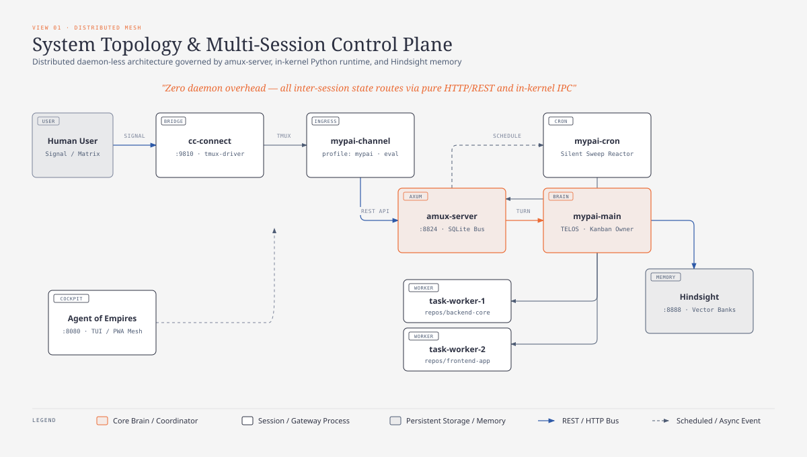
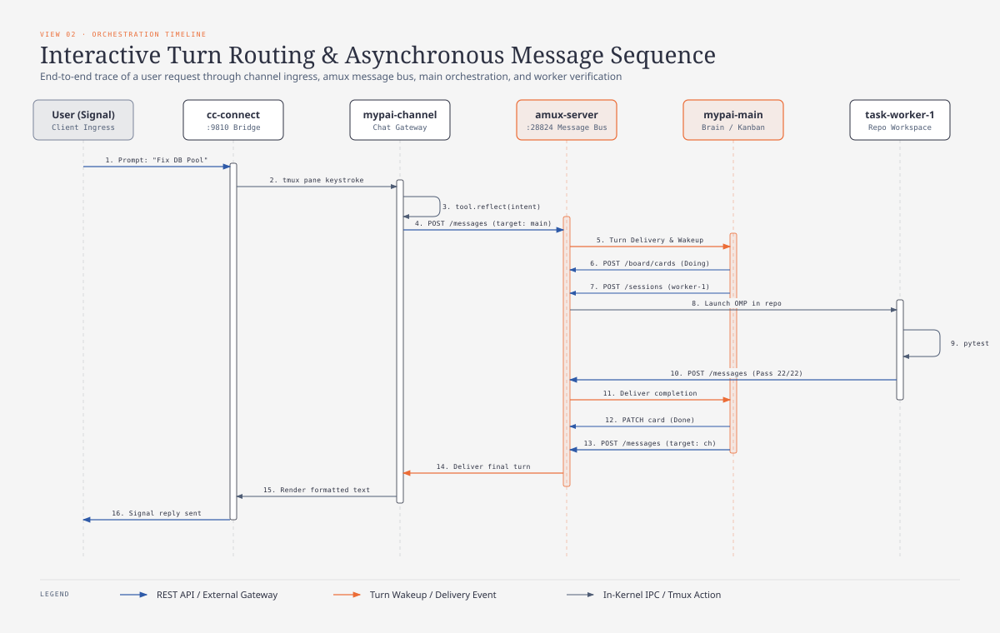
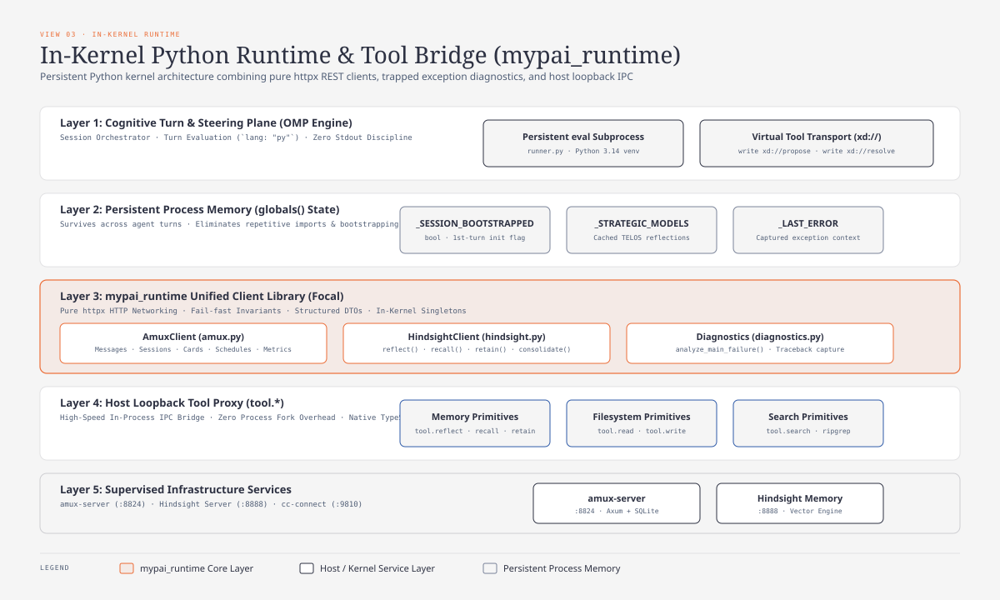
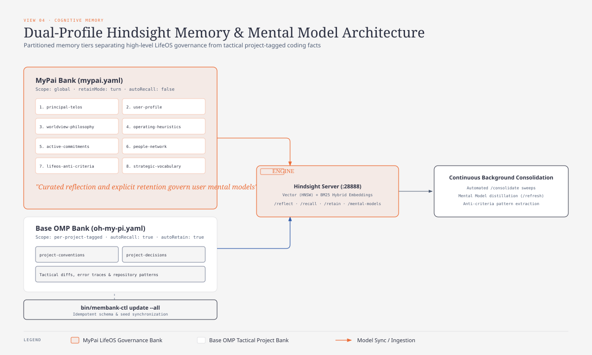
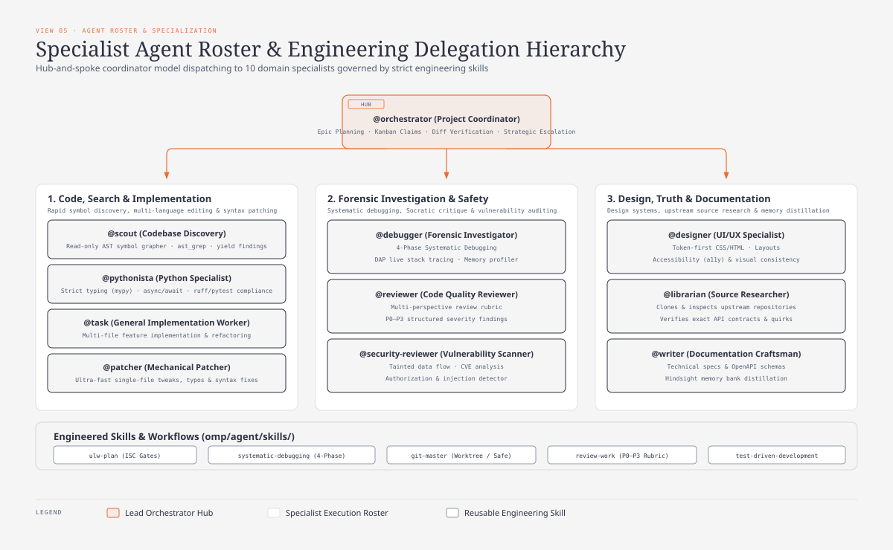
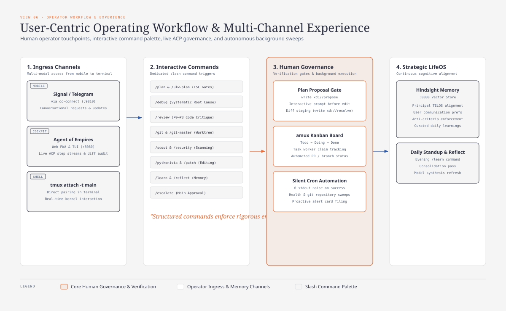

# Next-Generation MyPAI Visual Architecture & Overview

This document provides a comprehensive visual and structural overview of the **Next-Generation MyPAI** ecosystem across 6 production perspectives.

---

## 1. System Topology & Multi-Session Control Plane

The high-level distributed infrastructure layout connecting chat ingress, the central `amux-server` control plane, the core agent sessions (`mypai-main`, `mypai-channel`, `mypai-cron`), ephemeral task workers, Hindsight vector memory, and the Agent of Empires (`aoe`) observability cockpit.

---

## 2. Interactive Turn Routing & Asynchronous Message Sequence

The full lifecycle of an asynchronous user prompt: from Signal delivery via `cc-connect` to intent parsing in `mypai-channel`, correlation ID assignment, task worker execution in target repositories, Kanban progression (`Todo` $\to$ `Doing` $\to$ `Done`), and return path dispatch.

---

## 3. In-Kernel Python Runtime & Tool Bridge (`mypai_runtime`)

The in-kernel execution architecture (`lang: "py"`): persistent process memory (`globals()`), the unified `mypai_runtime` library (`AmuxClient`, `HindsightClient`, `diagnostics`), host loopback tool proxies (`tool.*`), and virtual tool devices (`xd://`).

---

## 4. Dual-Profile Hindsight Memory & Mental Model Architecture

The tiered cognitive memory model: partitioning global LifeOS strategic governance (8 persistent mental models in the `mypai` memory bank) from tactical per-project coding conventions in the `oh-my-pi` memory bank, backed by continuous background consolidation in Hindsight (:8888).

---

## 5. Specialist Agent Roster & Engineering Delegation Hierarchy

The hub-and-spoke coordination model: `@orchestrator` as the primary project coordinator delegating to 10 domain specialists (code implementation, forensic debugging, code review, security scanning, design, research, and documentation) governed by high-rigor engineering skills (`ulw-plan`, `systematic-debugging`, `git-master`, `review-work`, `tdd`).

---

## 6. User-Centric Operating Workflow & Multi-Channel Experience

The operator experience and daily lifecycle: multi-channel ingress (Signal/Telegram mobile chat, `aoe` Web PWA / TUI cockpit, direct tmux pairing), interactive slash command palette (`/plan`, `/debug`, `/review`, `/escalate`, `/learn`), interactive plan proposal gates (`write xd://propose`), and 24/7 background silent sweeps.

