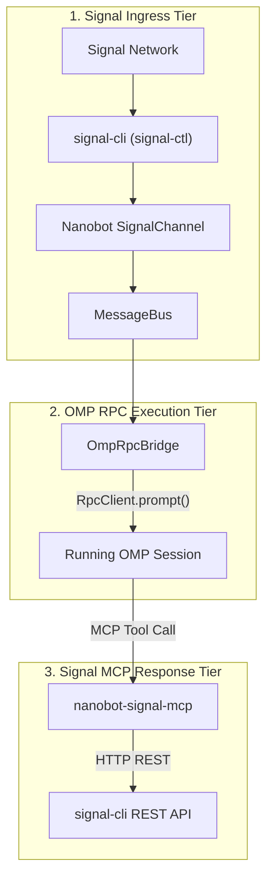

# Research: Nanobot Signal Gateway & OMP RPC Integration

## Executive Summary

This document presents research on integrating **`oh-my-pi` (OMP)** with a **minimal Nanobot Signal Gateway sidecar** and **`nanobot-signal-mcp`**. The architecture replaces Nanobot's full internal LLM agent loop with an RPC bridge that communicates strictly via the official Python **`omp_rpc.RpcClient`**. The bridge queues customized prompt messages into a running `omp` session. `omp` then interacts back with Signal using MCP tools exposed by `nanobot-signal-mcp` via the `signal-cli` REST API daemon.

---

## 1. Mandatory OMP RPC Communication (`omp_rpc.RpcClient`)

### 1.1 Python `RpcClient` Standard
All communication between background daemons/sidecars and `omp` **must mandatory use** `omp_rpc.RpcClient` (`from omp_rpc import RpcClient`). 
- **Transport**: Standard I/O (JSONL over `stdin`/`stdout`) or socket pipe attached to `omp --mode rpc`.
- **Headless UI Policy**: Automated using `client.install_headless_ui()` to handle confirmation/input dialogs headlessly.
- **Protocol Versioning**: Automatically negotiates protocol v2 (`negotiate_protocol`) and reassembles oversized frames (`rpc_chunk`).

### 1.2 Session Injection & Queueing Mechanics

Using `RpcClient`, daemons queue customized prompt messages into an active or new `omp` session:

```python
from omp_rpc import RpcClient

with RpcClient() as client:
    client.install_headless_ui()
    # Queue a customized prompt into the running session
    client.prompt("Customized daemon message with event data...")
```

#### RPC Execution Methods:
- **`client.prompt(message)`**: Standard prompt queueing. Acknowledged immediately; events stream until turn completion (`agent_end`).
- **`client.steer(message)`**: Injects an immediate steering message mid-turn to interrupt tool execution.
- **`client.follow_up(message)`**: Queues a message to execute after the current turn settles.
- **`client.abort_and_prompt(message)`**: Aborts ongoing turns and immediately starts processing the new prompt.
- **`client.switch_session(session_path)`**: Switches active session to a saved session file (`.omp/sessions/...`).

---

## 2. OMP Agent Plugins 1.0.0 Standard & `omp share`

### 2.1 Agent Plugins 1.0.0 Standard (`https://agent-plugins.org`)
Recent versions of `omp` (v17.2.11+) integrate full support for the Agent Plugins 1.0.0 standard.
- **Unified Package Format**: Governs plugin roots containing `plugin.json`, `mcp.json`, and `skills/`.
- **Strict Schema Validation**: Validates `$schema` identifiers (spec §5.2 for `plugin.json`, spec §7.2.1 for `mcp.json`) and safely skips or reports fatally invalid plugin packages.
- **Security & Containment**:
  - **Path Containment (spec §4.1)**: Ensures symlinks cannot traverse outside the plugin directory.
  - **Literal Env Values (spec §§4.1/9.2)**: Enforces environment variables as literal, opaque package data, preventing ambient shell expansion leaks.
  - **Origin Locking (spec §7.2.1)**: Locks MCP HTTP/SSE endpoints to prevent unauthorized header forwarding across origins.

### 2.2 `omp share <session>` Command
```bash
omp share <session_id_prefix_or_filepath>
```
- Shares/exports session state by ID prefix or session file path without launching an active agent turn.

---

## 3. Nanobot Source Analysis & Minimal Sidecar Architecture

### 3.1 Architecture Overview




### 3.2 Key Components

#### 1. Signal Daemon (`signal-ctl` / `signal-cli-rest-api`)
- Managed via `~/agent-shared/code/agents-shared/assistants/signal-ctl`.
- Runs `signal-cli` in daemon mode, exposing a REST API endpoint at `http://127.0.5.1:50888`.

#### 2. Modified Nanobot Gateway Sidecar (`OmpRpcBridge`)
- Replaces Nanobot's internal `AgentLoop` with an `RpcClient` bridge:
  - Listens to incoming `InboundMessage` events on the `MessageBus`.
  - Recalls memory context from Hindsight REST API (`http://localhost:8888`).
  - Formats a **customized interpretation prompt** and queues it into `omp` via `RpcClient`:

```python
from omp_rpc import RpcClient

def forward_signal_to_omp(sender: str, message_text: str, recalled_context: str) -> None:
    prompt_msg = (
        f"[Signal Inbound Message]\n"
        f"Sender: {sender}\n"
        f"Message: {message_text}\n"
        f"Recalled Memory Context:\n{recalled_context}\n\n"
        f"Instruction: Please evaluate this message and use the send_signal_message tool "
        f"from nanobot-signal-mcp to send a reply if necessary."
    )
    with RpcClient() as client:
        client.install_headless_ui()
        client.prompt(prompt_msg)
```

#### 3. `nanobot-signal-mcp` (MCP Server for Signal)
- FastMCP tool server exposed to `omp` via `mcp.json`.
- **Exposed Tools**:
  - `signal_read_messages(chat_id, limit=10)`: Fetches message history.
  - `signal_send_message(recipient, message, attachments=[])`: Sends messages via `signal-cli-rest-api`.
  - `signal_list_chats()`: Lists active contacts and groups.

---

## 4. References & Inspected Paths
- **`omp` Python RPC Client**: [`scratch/oh-my-pi/python/omp-rpc`](file:///home/wuxxin/agent-shared/code/mypai/scratch/oh-my-pi/python/omp-rpc)
- **`omp` RPC Spec**: [`scratch/oh-my-pi/docs/rpc.md`](file:///home/wuxxin/agent-shared/code/mypai/scratch/oh-my-pi/docs/rpc.md)
- **Signal Control Script**: [`~/agent-shared/code/agents-shared/assistants/signal-ctl`](file:///home/wuxxin/agent-shared/code/agents-shared/assistants/signal-ctl)
