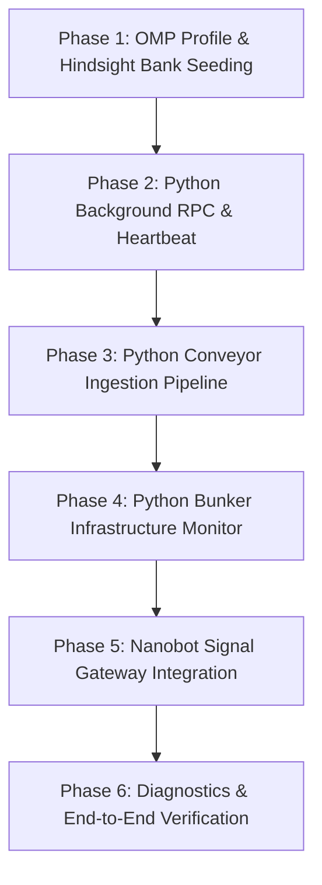

# Transposing LifeOS Featureset to Oh-My-PI (OMP) + Hindsight Architecture Plan

## Executive Summary

This document provides a comprehensive research summary and a grand multi-step implementation plan for transposing the core featureset of **LifeOS** ([scratch/LifeOS](file:///home/wuxxin/agent-shared/code/agents-shared/scratch/LifeOS)) into a dedicated **Oh-My-PI (OMP)** profile ([sandbox-templates/omp](file:///home/wuxxin/agent-shared/code/agents-shared/sandbox-templates/omp)).

By leveraging **Hindsight** for long-term memory (vector recall, turn retention, mental model reflection), Python background daemons for heartbeat/cron tasks, Python-native **Conveyor** (file inbox ingestion) and **Bunker Monitor** (infrastructure health), and an RPC-poke **Nanobot Signal Gateway**, we eliminate LifeOS's complex 53+ lifecycle hooks and file-based markdown reconcilers in favor of a clean, performant, background-service architecture.

---

## 1. Feature Transposition Matrix

| LifeOS Feature | LifeOS Implementation | OMP + Hindsight Transposition |
|---|---|---|
| **TELOS & Ideal State** | Markdown files in `TELOS/`, `ISAGate.hook.ts`, `ISA.md` per task | Native **Hindsight Mental Model** (`principal-telos`) automatically recalled on turns. |
| **Memory & Reconcile Loop** | `Cortex`, `MemoryWriter.ts`, `MemoryReviewer.ts`, `ISAReconcile.ts` | **Hindsight REST API** (`http://localhost:8888`) with `autoRecall`, `autoRetain`, and background `reflect` calls. |
| **Heartbeat / Cron System** | macOS `launchd` `.plist` & Linux `systemd --user` running Bun scripts | **Python `apscheduler` Service Daemon** (`omp_service_heartbeat.py`) issuing RPC pokes to OMP. |
| **Conveyor Ingestion** | TypeScript `Watcher.ts` / `Runner.ts` monitoring inbox drop folders | **Python `watchdog` + `asyncio` Ingestion Daemon** (`omp_conveyor.py`) with quiescence gating, SHA256 hashing, sidecar parsing, and automated Hindsight insertion. |
| **Signal Messaging Gateway** | Custom node/bun wrappers | **Nanobot Signal Sidecar** (`python3 -m omp_tools.nanobot_mcp` + `signal-cli` port 50889) receiving RPC pokes. |
| **Lifecycle Hooks (53+)** | TS/Bun hooks intercepting 6 Claude Code events | **Native OMP Extensions & Rules** (`~/.omp/agent/rules/`) with zero hook performance overhead. |

---

## 2. Detailed Feature Breakdown & Python Implementations

### 2.1 Python Conveyor Ingestion Pipeline (`omp_conveyor.py`)

The **Conveyor** watches an inbox directory (e.g. `~/Recordings/Inbox`), waits for incoming media/document files to stop growing (**quiescence gate**), hashes the file (`sha256` head + size), parses optional `<file>.md` metadata sidecars, transcribes audio/video via local STT (port 50090), and retains key insights directly into Hindsight long-term memory.

```python
#!/usr/bin/env python3
"""OMP Conveyor Ingestion Pipeline (Python).

Monitors inbox drop folder, applies quiescence gating, sha256 content hashing,
sidecar parsing, local STT transcription, and automated Hindsight retention.
"""

import asyncio
import hashlib
from pathlib import Path
import time
from typing import Dict, Optional
import httpx
from watchdog.events import FileSystemEventHandler
from watchdog.observers import Observer

INBOX_DIR = Path.home() / "Recordings" / "Inbox"
QUIESCENCE_SECONDS = 10.0
STT_URL = "http://localhost:50090/v1/audio/transcriptions"
HINDSIGHT_URL = "http://localhost:8888"


def compute_content_hash(file_path: Path) -> str:
    """Fast SHA256 over file size + head 8MB."""
    stat = file_path.stat()
    h = hashlib.sha256()
    h.update(f"{stat.st_size}\n".encode())
    with open(file_path, "rb") as f:
        head = f.read(8 * 1024 * 1024)
        h.update(head)
    return h.hexdigest()[:12]


def parse_sidecar(sidecar_path: Path) -> Dict[str, str]:
    """Parse key: value lines from sidecar markdown file."""
    meta = {}
    if sidecar_path.exists():
        for line in sidecar_path.read_text().splitlines():
            if ":" in line:
                k, v = line.split(":", 1)
                meta[k.strip().lower()] = v.strip()
    return meta


class ConveyorIngestor:

    def __init__(self, inbox: Path = INBOX_DIR):
        self.inbox = inbox
        self.processed_hashes = set()
        self.http = httpx.AsyncClient(timeout=120.0)

    async def process_file(self, file_path: Path):
        if file_path.name.startswith(".") or file_path.suffix == ".md":
            return
        if not file_path.exists():
            return

        # Quiescence check (wait until file size is stable)
        last_size = -1
        stable_start = time.time()
        while time.time() - stable_start < QUIESCENCE_SECONDS:
            if not file_path.exists():
                return
            cur_size = file_path.stat().st_size
            if cur_size != last_size:
                last_size = cur_size
                stable_start = time.time()
            await asyncio.sleep(1.0)

        item_hash = compute_content_hash(file_path)
        if item_hash in self.processed_hashes:
            return
        self.processed_hashes.add(item_hash)

        print(f"[Conveyor] Ingesting {file_path.name} (hash: {item_hash})")

        # Sidecar metadata
        sidecar = parse_sidecar(file_path.with_suffix(file_path.suffix + ".md"))
        title = sidecar.get("title", file_path.stem)

        # Transcribe audio/video if media file
        transcript = ""
        if file_path.suffix.lower() in [
            ".wav",
            ".mp3",
            ".m4a",
            ".mp4",
            ".mov",
            ".flac",
        ]:
            try:
                with open(file_path, "rb") as audio_file:
                    res = await self.http.post(
                        STT_URL,
                        files={"file": audio_file},
                        data={"model": "whisper-1"},
                    )
                    if res.status_code == 200:
                        transcript = res.json().get("text", "")
                        print(
                            f"[Conveyor] Transcribed {len(transcript)} chars."
                        )
            except Exception as e:
                print(f"[Conveyor] STT failed: {e}")

        # Retain into Hindsight memory bank
        memory_content = f"Content Ingestion ({title}): {transcript if transcript else 'File registered.'}"
        try:
            await self.http.post(
                f"{HINDSIGHT_URL}/v1/default/banks/omp-orchestrator/retain",
                json={
                    "content": memory_content,
                    "tags": ["conveyor", "ingestion", item_hash],
                },
            )
            print(f"[Conveyor] Retained into Hindsight bank `omp-orchestrator`.")
        except Exception as e:
            print(f"[Conveyor] Hindsight retain failed: {e}")
```

---


## 3. Grand Multi-Step Implementation Plan



### Phase 1: OMP Profile & Hindsight Bank Auto-Seeding
- **Goal**: Provision the OMP sandbox profile with native Hindsight auto-seeding.
- **Tasks**:
  1. Inspect and update `sandbox-templates/omp/omp/agent/config.yml` to set `hindsight.bankId: omp-orchestrator` and `hindsight.mentalModelAutoSeed: true`.
  2. Define seed mental model configs (`principal-telos.json`, `user-preferences.json`, `active-commitments.json`) in `sandbox-templates/omp/omp/agent/hindsight-bankconfig/`.
  3. Verify `update-memory-banks.sh` correctly provisions and patches bank state at startup.

### Phase 2: Python Background RPC Service & Heartbeat Runner
- **Goal**: Establish persistent background execution and cron triggers.
- **Tasks**:
  1. Implement `omp_service_heartbeat.py` using `apscheduler`, `httpx`, and `asyncio`.
  2. Configure periodic jobs for **Work Sweep** (every 30 mins) and **Hindsight Reflection** (every 2 hours).
  3. Test RPC poke communication with the OMP background daemon.

### Phase 3: Python Conveyor Ingestion Pipeline
- **Goal**: Ingest external drop-folder content automatically into long-term memory.
- **Tasks**:
  1. Create `omp_conveyor.py` in `sandbox-templates/omp/omp/agent/tools/` using `watchdog` and `asyncio`.
  2. Implement quiescence gating (10s size stability), `sha256` content hashing, and `.md` sidecar parsing.
  3. Integrate local STT (port 50090) for audio/video transcription and automatic Hindsight `retain` API posting.

### Phase 4: Python Bunker Infrastructure Monitor
- **Goal**: Continuous local service health probing and diagnostic reporting.
- **Tasks**:
  1. Create `omp_bunker_monitor.py` to probe ports 51080, 8888, 50889, 50090, 50095.
  2. Integrate health metrics into an `omp doctor` CLI diagnostic command.

### Phase 5: Nanobot Signal Gateway Integration
- **Goal**: Connect Signal messaging channel to OMP background daemon without per-message process overhead.
- **Tasks**:
  1. Verify `nanobot-signal` MCP (`python3 -m omp_tools.nanobot_mcp`) and `signal-cli` daemon (port 50889).
  2. Route incoming Signal messages to OMP service via `agent_poke(message, sender_id)` RPC calls.
  3. Formulate responses using Hindsight memory context and dispatch replies via `nanobot-signal`.

### Phase 6: Diagnostics & End-to-End Verification
- **Goal**: Validate end-to-end functionality across all components.
- **Tasks**:
  1. Run `omp doctor` to verify service readiness.
  2. Drop test audio/text files into `~/Recordings/Inbox` to verify Conveyor ingestion and Hindsight memory retention.
  3. Trigger background RPC pokes and verify Hindsight reflection log output.

---

## Verification Plan

### Automated Verification
- Run `python3 sandbox-templates/omp/omp/agent/tools/omp_bunker_monitor.py` to verify all 5 underlying local services return healthy status codes.
- Test Conveyor hashing and quiescence unit logic with synthetic sample files.

### Manual Verification
- Deploy sandbox via `sandbox-ctl install omp --no-start --new-config-from sandbox-templates/omp/omp.env`.
- Verify memory bank auto-seeding via `curl http://localhost:8888/v1/default/banks/omp-orchestrator/mental-models`.
